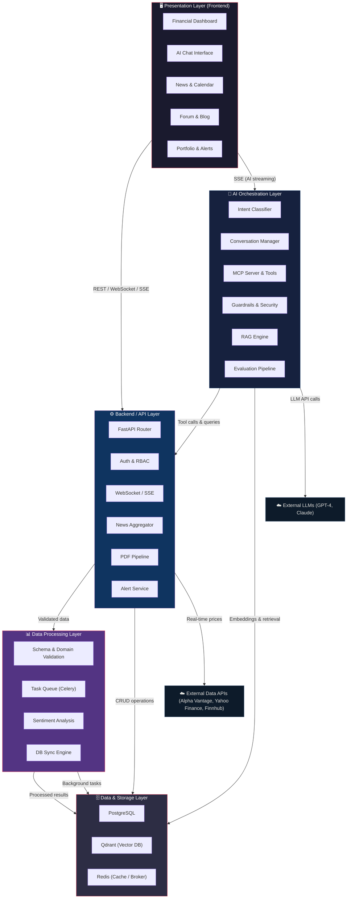
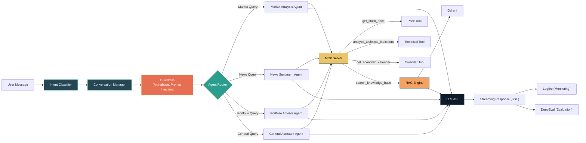
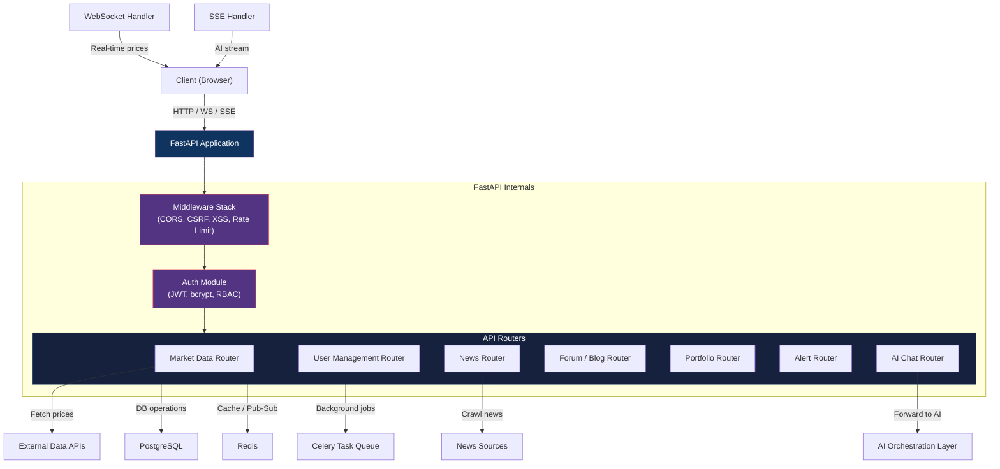
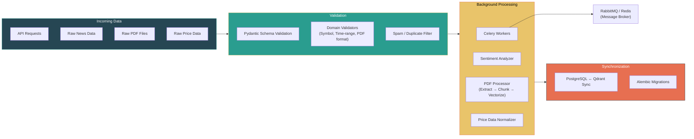
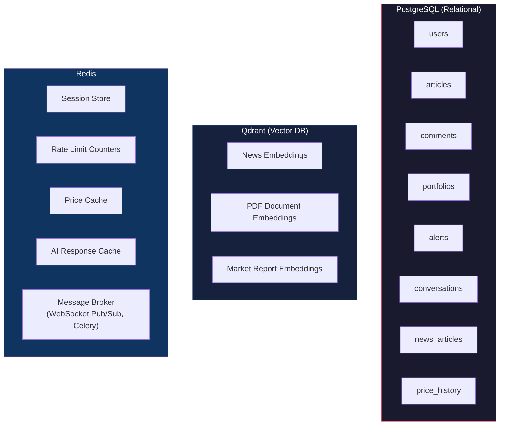
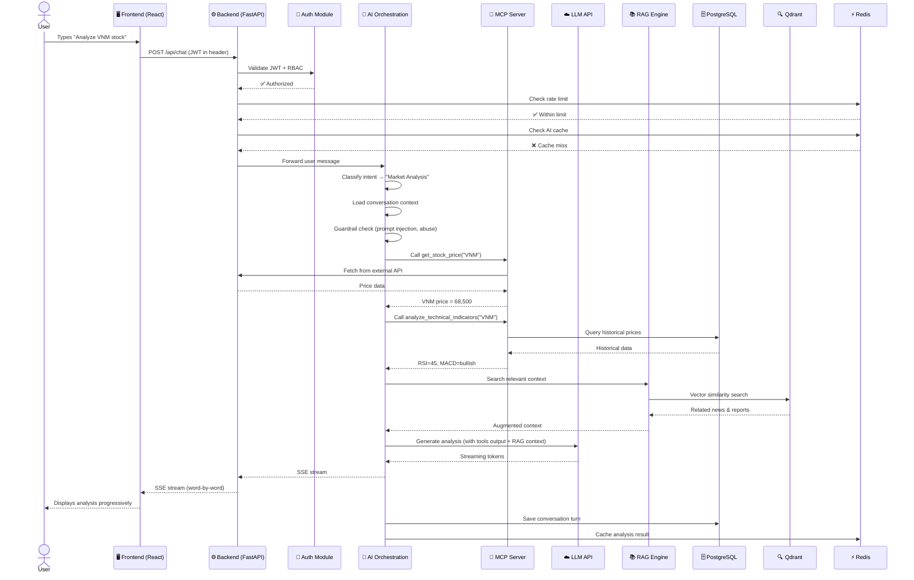
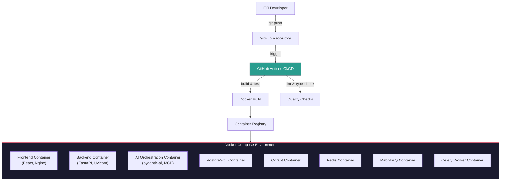
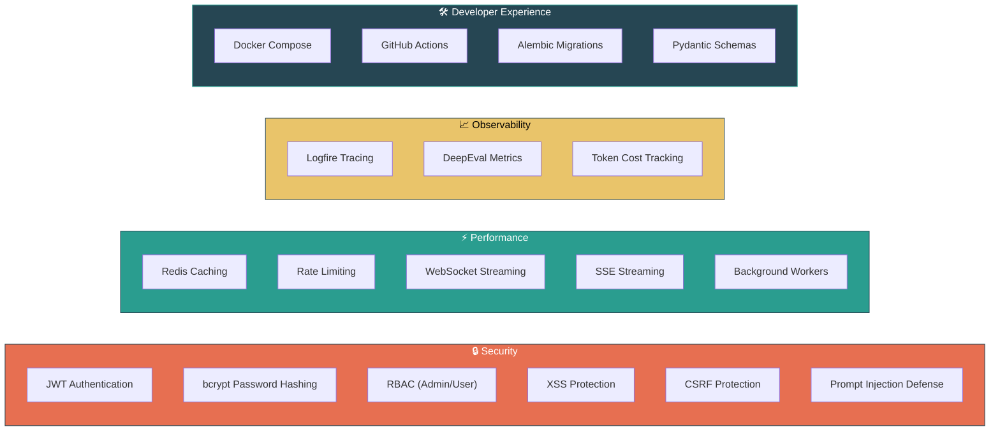

# Architecture Design

**Project**: _"Research and design a web application for financial market analysis based on multi-agent artificial intelligence"_

---

## 1. High-Level System Architecture

The system is organized into **five distinct layers**. Each layer has a clear responsibility and communicates with adjacent layers through well-defined interfaces.

---

## 2. Detailed Layer Breakdown

### 2.1 Presentation Layer (Frontend)

| Entity | Technology | Responsibility |
|---|---|---|
| **Financial Dashboard** | React, Lightweight Charts, Zustand | Real-time price charts, flexible drag-and-drop layout |
| **AI Chat Interface** | React, SSE consumer | Streaming AI responses, quick action buttons, multi-format output (text, table, chart) |
| **News & Economic Calendar** | React, TailwindCSS | Chronological news feed, economic calendar table |
| **Forum & Blog** | React, Rich Text Editor | User-authored articles with embedded live charts, comments, ratings, PDF import |
| **Portfolio & Alerts** | React, WebSocket consumer | Watchlist management, alert configuration UI |

**Cross-cutting**: i18n (EN/VI), Light/Dark mode, social sharing, fallback messages.

---

### 2.2 AI Orchestration Layer

This is the intelligence core. It receives user messages and orchestrates multi-agent workflows.

| Entity | Tech | Description |
|---|---|---|
| **Intent Classifier** | pydantic-ai | Categorizes user intent (chart, news, analysis, general chat) |
| **Conversation Manager** | pydantic-ai, SQLAlchemy | Tracks multi-turn state, stores conversation history and user context |
| **Guardrails** | Custom middleware | Anti-abuse filter, prompt injection detection, content moderation |
| **Agent Router** | pydantic-ai | Dispatches to the correct specialized agent based on classified intent |
| **MCP Server & Tools** | MCP Protocol | Exposes callable tools (`get_stock_price`, `analyze_technical_indicators`, etc.) |
| **RAG Engine** | Qdrant + LLM | Retrieves relevant embeddings from vector DB and augments LLM context |
| **Monitoring** | Logfire | Traces agent execution, latency, token usage |
| **Evaluation** | DeepEval | LLM-as-a-Judge evaluation for response quality |
| **Caching** | Redis | Caches previous analysis results when market hasn't fluctuated |
| **Rate Limiter** | Redis | Restricts queries/minute per user to prevent budget depletion |

---

### 2.3 Backend / API Layer

| Entity | Tech | Description |
|---|---|---|
| **FastAPI Application** | FastAPI (Python 3.13) | Central HTTP server, routes all API requests |
| **Auth Module** | JWT, bcrypt | User authentication, password hashing, token issuance/verification |
| **RBAC** | Custom middleware | Role-based access control (Admin / User) |
| **Security Middleware** | FastAPI middleware | CORS, CSRF protection, XSS sanitization |
| **Market Data Router** | REST endpoints | Proxies and caches real-time price data from external providers |
| **News Aggregator** | Background worker | Crawls international financial news sources, deduplicates, stores |
| **PDF Pipeline** | PyMuPDF / pdfplumber, LangChain | Text extraction → chunking → vectorization for RAG |
| **WebSocket Handler** | FastAPI WebSockets + Redis Pub/Sub | Streams real-time price updates to connected clients |
| **SSE Handler** | FastAPI StreamingResponse | Streams AI-generated tokens word-by-word to client |
| **Alert Service** | Celery + Redis | Monitors price thresholds and news triggers, notifies users |

---

### 2.4 Data Processing Layer

| Entity | Tech | Description |
|---|---|---|
| **Pydantic Validators** | Pydantic v2 | Strict schema validation for all request/response payloads |
| **Domain Validators** | Custom | Validates asset symbols, time ranges, file formats |
| **Spam Filter** | Custom | Removes duplicate/irrelevant news before sentiment analysis |
| **Celery Workers** | Celery + RabbitMQ/Redis | Execute heavy tasks asynchronously (PDF processing, historical data collection) |
| **Sentiment Analyzer** | LLM + custom pipeline | Analyzes news sentiment for market impact scoring |
| **PDF Processor** | PyMuPDF, LangChain | Extracts text → splits into chunks → generates embeddings |
| **DB Sync Engine** | Custom scheduled job | Keeps PostgreSQL and Qdrant in sync for consistent RAG results |
| **Alembic** | Alembic | Database migration management for PostgreSQL schema changes |

---

### 2.5 Data & Storage Layer

| Store | Technology | Data Stored |
|---|---|---|
| **PostgreSQL** | PostgreSQL | Users, articles, comments, portfolios, alerts, conversations, news, price history |
| **Qdrant** | Qdrant | Vector embeddings for news, PDF documents, and market reports (used by RAG) |
| **Redis** | Redis | Session data, rate limit counters, cached prices, cached AI responses, message brokering |

---

## 3. End-to-End Request Flow

The following diagram traces a typical user interaction from the frontend through all layers and back.

---

## 4. DevOps & Deployment Architecture

| Component | Container | Ports |
|---|---|---|
| Frontend | React + Nginx | 80/443 |
| Backend API | FastAPI + Uvicorn | 8000 |
| AI Orchestration | pydantic-ai + MCP Server | 8001 |
| PostgreSQL | postgres:16 | 5432 |
| Qdrant | qdrant/qdrant | 6333 |
| Redis | redis:7 | 6379 |
| RabbitMQ | rabbitmq:3 | 5672/15672 |
| Celery Workers | Custom Python image | — |

---

## 5. Cross-Cutting Concerns

