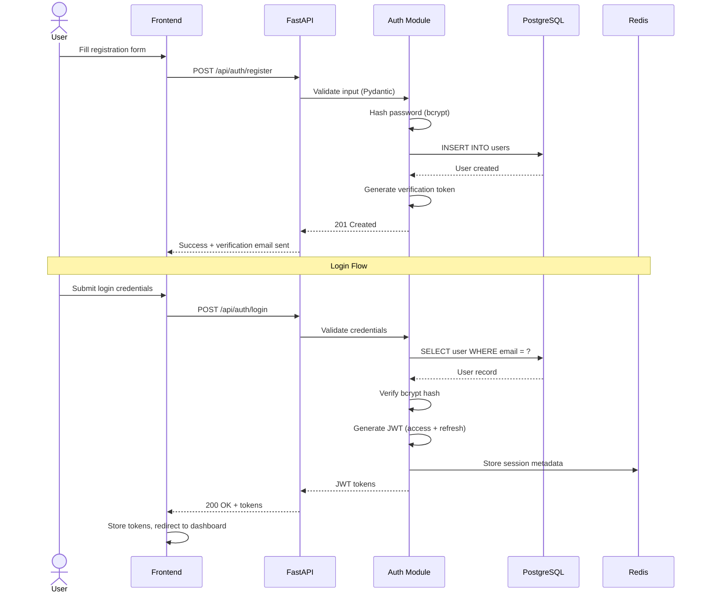
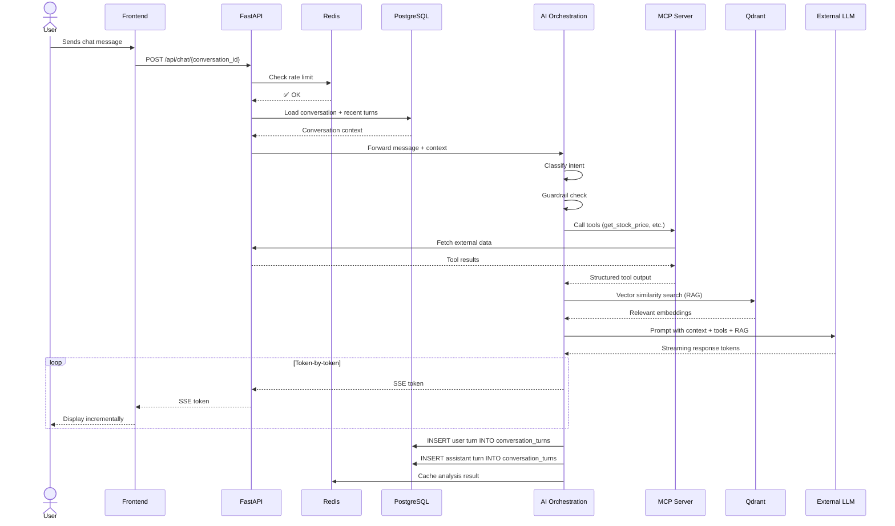
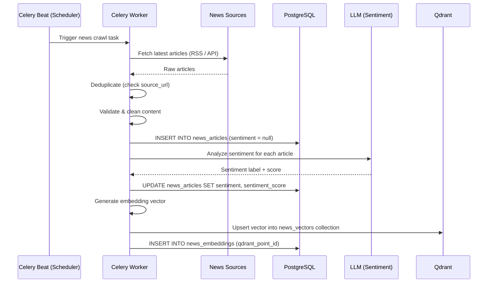
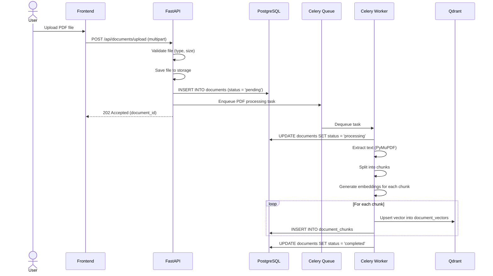
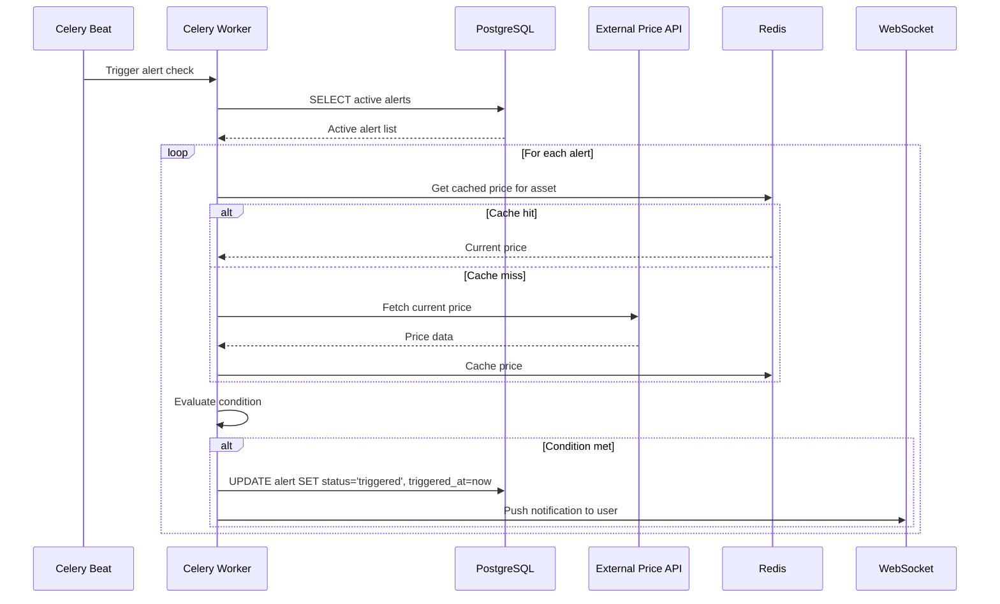

# Database Design

**Project**: _"Research and design a web application for financial market analysis based on multi-agent artificial intelligence"_

> All tables inherit `id` (UUID, PK), `created_at`, and `updated_at` from the SQLAlchemy `Base` model defined in `src/core/base_model.py`.

---

## 1. Entity-Relationship Diagram (ERD)

```mermaid
erDiagram
    users ||--o{ articles : "authors"
    users ||--o{ comments : "writes"
    users ||--o{ article_ratings : "rates"
    users ||--o{ portfolios : "owns"
    users ||--o{ watchlist_items : "tracks"
    users ||--o{ alerts : "sets"
    users ||--o{ conversations : "initiates"
    users ||--o{ user_preferences : "has"

    articles ||--o{ comments : "has"
    articles ||--o{ article_ratings : "receives"
    articles ||--o{ article_tags : "tagged_with"
    tags ||--o{ article_tags : "applied_to"

    portfolios ||--o{ portfolio_holdings : "contains"

    conversations ||--o{ conversation_turns : "contains"

    news_articles ||--o{ news_embeddings : "vectorized_as"
    documents ||--o{ document_chunks : "split_into"

    assets ||--o{ price_history : "has"
    assets ||--o{ watchlist_items : "watched_in"
    assets ||--o{ portfolio_holdings : "held_in"
    assets ||--o{ alerts : "monitored_by"

    users {
        uuid id PK
        string username
        string email UK
        string password_hash
        boolean is_verified
        string role
        string display_name
        string avatar_url
        text bio
        timestamp created_at
        timestamp updated_at
    }

    articles {
        uuid id PK
        uuid author_id FK
        string title
        string slug UK
        text content
        text excerpt
        string cover_image_url
        string status
        integer view_count
        timestamp published_at
        timestamp created_at
        timestamp updated_at
    }

    comments {
        uuid id PK
        uuid article_id FK
        uuid user_id FK
        uuid parent_id FK
        text content
        timestamp created_at
        timestamp updated_at
    }

    article_ratings {
        uuid id PK
        uuid article_id FK
        uuid user_id FK
        integer rating
        timestamp created_at
    }

    tags {
        uuid id PK
        string name UK
        string slug UK
    }

    article_tags {
        uuid article_id FK
        uuid tag_id FK
    }

    assets {
        uuid id PK
        string symbol UK
        string name
        string asset_type
        string exchange
        string currency
        boolean is_active
        timestamp created_at
        timestamp updated_at
    }

    price_history {
        uuid id PK
        uuid asset_id FK
        timestamp timestamp
        decimal open
        decimal high
        decimal low
        decimal close
        bigint volume
        string interval
    }

    portfolios {
        uuid id PK
        uuid user_id FK
        string name
        text description
        boolean is_default
        timestamp created_at
        timestamp updated_at
    }

    portfolio_holdings {
        uuid id PK
        uuid portfolio_id FK
        uuid asset_id FK
        decimal quantity
        decimal avg_buy_price
        text notes
        timestamp acquired_at
        timestamp created_at
        timestamp updated_at
    }

    watchlist_items {
        uuid id PK
        uuid user_id FK
        uuid asset_id FK
        integer sort_order
        timestamp created_at
    }

    alerts {
        uuid id PK
        uuid user_id FK
        uuid asset_id FK
        string alert_type
        string condition
        decimal target_value
        string status
        text message
        timestamp triggered_at
        timestamp created_at
        timestamp updated_at
    }

    conversations {
        uuid id PK
        uuid user_id FK
        string title
        string status
        jsonb metadata
        timestamp created_at
        timestamp updated_at
    }

    conversation_turns {
        uuid id PK
        uuid conversation_id FK
        string role
        text content
        jsonb tool_calls
        integer token_count
        integer turn_index
        timestamp created_at
    }

    news_articles {
        uuid id PK
        string title
        text content
        string source
        string source_url UK
        string category
        string sentiment
        float sentiment_score
        string language
        timestamp published_at
        timestamp created_at
    }

    news_embeddings {
        uuid id PK
        uuid news_article_id FK
        string qdrant_point_id
        string collection_name
        timestamp created_at
    }

    documents {
        uuid id PK
        uuid uploaded_by FK
        string filename
        string file_path
        string mime_type
        integer file_size_bytes
        string processing_status
        timestamp created_at
        timestamp updated_at
    }

    document_chunks {
        uuid id PK
        uuid document_id FK
        integer chunk_index
        text content
        string qdrant_point_id
        string collection_name
        timestamp created_at
    }

    user_preferences {
        uuid id PK
        uuid user_id FK
        string theme
        string language
        string default_asset_type
        jsonb dashboard_layout
        jsonb notification_settings
        timestamp created_at
        timestamp updated_at
    }

    economic_calendar {
        uuid id PK
        string event_name
        string country_code
        string impact_level
        decimal forecast_value
        decimal previous_value
        decimal actual_value
        timestamp event_time
        timestamp created_at
    }
```

---

## 2. Table Definitions

### 2.1 `users`

Stores all registered user accounts. Existing model in `src/auth/models.py`.

| Column | Type | Constraints | Description |
|---|---|---|---|
| `id` | `UUID` | PK, NOT NULL, DEFAULT uuid4 | Unique user identifier |
| `username` | `VARCHAR(100)` | NOT NULL | Display username |
| `email` | `VARCHAR(50)` | UNIQUE, NOT NULL | Login email address |
| `password_hash` | `VARCHAR(512)` | NOT NULL | bcrypt-hashed password |
| `is_verified` | `BOOLEAN` | DEFAULT false | Email verification status |
| `role` | `VARCHAR(20)` | DEFAULT 'user' | Role: `admin` \| `user` |
| `display_name` | `VARCHAR(100)` | NULLABLE | Optional display name |
| `avatar_url` | `VARCHAR(512)` | NULLABLE | Profile picture URL |
| `bio` | `TEXT` | NULLABLE | User biography |
| `created_at` | `TIMESTAMPTZ` | NOT NULL, DEFAULT now | Account creation time |
| `updated_at` | `TIMESTAMPTZ` | NOT NULL, DEFAULT now | Last update time |

**Indexes**: `email` (unique), `id` (primary)

---

### 2.2 `articles`

Blog/forum posts authored by users.

| Column | Type | Constraints | Description |
|---|---|---|---|
| `id` | `UUID` | PK | Unique article identifier |
| `author_id` | `UUID` | FK → `users.id`, NOT NULL | Article author |
| `title` | `VARCHAR(300)` | NOT NULL | Article title |
| `slug` | `VARCHAR(350)` | UNIQUE, NOT NULL | URL-friendly slug |
| `content` | `TEXT` | NOT NULL | Article body (rich text / markdown) |
| `excerpt` | `TEXT` | NULLABLE | Short summary for listing pages |
| `cover_image_url` | `VARCHAR(512)` | NULLABLE | Cover image URL |
| `status` | `VARCHAR(20)` | NOT NULL, DEFAULT 'draft' | `draft` \| `published` \| `archived` |
| `view_count` | `INTEGER` | DEFAULT 0 | Read counter |
| `published_at` | `TIMESTAMPTZ` | NULLABLE | Publication timestamp |
| `created_at` | `TIMESTAMPTZ` | DEFAULT now | – |
| `updated_at` | `TIMESTAMPTZ` | DEFAULT now | – |

**Indexes**: `slug` (unique), `author_id`, `status`, `published_at DESC`

---

### 2.3 `comments`

Threaded comments on articles. Supports nesting via `parent_id`.

| Column | Type | Constraints | Description |
|---|---|---|---|
| `id` | `UUID` | PK | – |
| `article_id` | `UUID` | FK → `articles.id`, NOT NULL, ON DELETE CASCADE | Parent article |
| `user_id` | `UUID` | FK → `users.id`, NOT NULL | Comment author |
| `parent_id` | `UUID` | FK → `comments.id`, NULLABLE | Parent comment (for nesting) |
| `content` | `TEXT` | NOT NULL | Comment body |
| `created_at` | `TIMESTAMPTZ` | DEFAULT now | – |
| `updated_at` | `TIMESTAMPTZ` | DEFAULT now | – |

**Indexes**: `article_id`, `user_id`, `parent_id`

---

### 2.4 `article_ratings`

1–5 star ratings on articles. One rating per user per article.

| Column | Type | Constraints | Description |
|---|---|---|---|
| `id` | `UUID` | PK | – |
| `article_id` | `UUID` | FK → `articles.id`, NOT NULL, ON DELETE CASCADE | Rated article |
| `user_id` | `UUID` | FK → `users.id`, NOT NULL | Rating user |
| `rating` | `INTEGER` | NOT NULL, CHECK (1–5) | Star rating value |
| `created_at` | `TIMESTAMPTZ` | DEFAULT now | – |

**Constraints**: UNIQUE(`article_id`, `user_id`)

---

### 2.5 `tags` & `article_tags`

Tag system for categorizing articles. Many-to-many relationship.

#### `tags`

| Column | Type | Constraints | Description |
|---|---|---|---|
| `id` | `UUID` | PK | – |
| `name` | `VARCHAR(50)` | UNIQUE, NOT NULL | Tag display name |
| `slug` | `VARCHAR(60)` | UNIQUE, NOT NULL | URL-friendly version |

#### `article_tags` (Join table)

| Column | Type | Constraints | Description |
|---|---|---|---|
| `article_id` | `UUID` | FK → `articles.id`, PK | – |
| `tag_id` | `UUID` | FK → `tags.id`, PK | – |

**Primary Key**: Composite (`article_id`, `tag_id`)

---

### 2.6 `assets`

Master table of financial instruments (stocks, forex, commodities).

| Column | Type | Constraints | Description |
|---|---|---|---|
| `id` | `UUID` | PK | – |
| `symbol` | `VARCHAR(20)` | UNIQUE, NOT NULL | Ticker symbol (e.g., `VNM`, `EUR/USD`) |
| `name` | `VARCHAR(200)` | NOT NULL | Full asset name |
| `asset_type` | `VARCHAR(30)` | NOT NULL | `stock` \| `forex` \| `commodity` \| `crypto` \| `index` |
| `exchange` | `VARCHAR(50)` | NULLABLE | Exchange name (e.g., `HOSE`, `NASDAQ`) |
| `currency` | `VARCHAR(10)` | NOT NULL, DEFAULT 'USD' | Denomination currency |
| `is_active` | `BOOLEAN` | DEFAULT true | Whether asset is actively tracked |
| `created_at` | `TIMESTAMPTZ` | DEFAULT now | – |
| `updated_at` | `TIMESTAMPTZ` | DEFAULT now | – |

**Indexes**: `symbol` (unique), `asset_type`

---

### 2.7 `price_history`

OHLCV candlestick data for each asset.

| Column | Type | Constraints | Description |
|---|---|---|---|
| `id` | `UUID` | PK | – |
| `asset_id` | `UUID` | FK → `assets.id`, NOT NULL | Associated asset |
| `timestamp` | `TIMESTAMPTZ` | NOT NULL | Candle open time |
| `open` | `DECIMAL(18,6)` | NOT NULL | Open price |
| `high` | `DECIMAL(18,6)` | NOT NULL | High price |
| `low` | `DECIMAL(18,6)` | NOT NULL | Low price |
| `close` | `DECIMAL(18,6)` | NOT NULL | Close price |
| `volume` | `BIGINT` | DEFAULT 0 | Trade volume |
| `interval` | `VARCHAR(10)` | NOT NULL | `1m` \| `5m` \| `1h` \| `1d` \| `1w` \| `1M` |

**Constraints**: UNIQUE(`asset_id`, `timestamp`, `interval`)
**Indexes**: `asset_id` + `timestamp DESC` (composite), `interval`

> [!TIP]
> Consider using TimescaleDB hypertable extension for `price_history` if the dataset grows very large, enabling efficient time-series queries and automatic data retention policies.

---

### 2.8 `portfolios` & `portfolio_holdings`

User portfolio management with individual holdings.

#### `portfolios`

| Column | Type | Constraints | Description |
|---|---|---|---|
| `id` | `UUID` | PK | – |
| `user_id` | `UUID` | FK → `users.id`, NOT NULL | Portfolio owner |
| `name` | `VARCHAR(100)` | NOT NULL | Portfolio name |
| `description` | `TEXT` | NULLABLE | Optional description |
| `is_default` | `BOOLEAN` | DEFAULT false | Default portfolio flag |
| `created_at` | `TIMESTAMPTZ` | DEFAULT now | – |
| `updated_at` | `TIMESTAMPTZ` | DEFAULT now | – |

#### `portfolio_holdings`

| Column | Type | Constraints | Description |
|---|---|---|---|
| `id` | `UUID` | PK | – |
| `portfolio_id` | `UUID` | FK → `portfolios.id`, NOT NULL, ON DELETE CASCADE | Parent portfolio |
| `asset_id` | `UUID` | FK → `assets.id`, NOT NULL | Held asset |
| `quantity` | `DECIMAL(18,6)` | NOT NULL | Number of units held |
| `avg_buy_price` | `DECIMAL(18,6)` | NOT NULL | Average purchase price |
| `notes` | `TEXT` | NULLABLE | User notes |
| `acquired_at` | `TIMESTAMPTZ` | NULLABLE | Purchase date |
| `created_at` | `TIMESTAMPTZ` | DEFAULT now | – |
| `updated_at` | `TIMESTAMPTZ` | DEFAULT now | – |

**Constraints**: UNIQUE(`portfolio_id`, `asset_id`)

---

### 2.9 `watchlist_items`

Quick-access list of assets a user is tracking.

| Column | Type | Constraints | Description |
|---|---|---|---|
| `id` | `UUID` | PK | – |
| `user_id` | `UUID` | FK → `users.id`, NOT NULL | List owner |
| `asset_id` | `UUID` | FK → `assets.id`, NOT NULL | Watched asset |
| `sort_order` | `INTEGER` | DEFAULT 0 | Display ordering |
| `created_at` | `TIMESTAMPTZ` | DEFAULT now | – |

**Constraints**: UNIQUE(`user_id`, `asset_id`)

---

### 2.10 `alerts`

Price and news-based alerts configured by users.

| Column | Type | Constraints | Description |
|---|---|---|---|
| `id` | `UUID` | PK | – |
| `user_id` | `UUID` | FK → `users.id`, NOT NULL | Alert owner |
| `asset_id` | `UUID` | FK → `assets.id`, NULLABLE | Associated asset (null for news alerts) |
| `alert_type` | `VARCHAR(30)` | NOT NULL | `price_above` \| `price_below` \| `price_cross` \| `news_sentiment` |
| `condition` | `VARCHAR(20)` | NOT NULL | `gte` \| `lte` \| `eq` \| `crosses` |
| `target_value` | `DECIMAL(18,6)` | NULLABLE | Target price threshold |
| `status` | `VARCHAR(20)` | NOT NULL, DEFAULT 'active' | `active` \| `triggered` \| `disabled` |
| `message` | `TEXT` | NULLABLE | Custom alert message |
| `triggered_at` | `TIMESTAMPTZ` | NULLABLE | When the alert fired |
| `created_at` | `TIMESTAMPTZ` | DEFAULT now | – |
| `updated_at` | `TIMESTAMPTZ` | DEFAULT now | – |

**Indexes**: `user_id`, `status`, `asset_id`

---

### 2.11 `conversations` & `conversation_turns`

AI chat history, stored per user.

#### `conversations`

| Column | Type | Constraints | Description |
|---|---|---|---|
| `id` | `UUID` | PK | – |
| `user_id` | `UUID` | FK → `users.id`, NOT NULL | Conversation owner |
| `title` | `VARCHAR(200)` | NULLABLE | Auto-generated or user-set title |
| `status` | `VARCHAR(20)` | DEFAULT 'active' | `active` \| `archived` |
| `metadata` | `JSONB` | NULLABLE | Agent config, model used, etc. |
| `created_at` | `TIMESTAMPTZ` | DEFAULT now | – |
| `updated_at` | `TIMESTAMPTZ` | DEFAULT now | – |

#### `conversation_turns`

| Column | Type | Constraints | Description |
|---|---|---|---|
| `id` | `UUID` | PK | – |
| `conversation_id` | `UUID` | FK → `conversations.id`, NOT NULL, ON DELETE CASCADE | Parent conversation |
| `role` | `VARCHAR(20)` | NOT NULL | `user` \| `assistant` \| `tool` \| `system` |
| `content` | `TEXT` | NOT NULL | Message content |
| `tool_calls` | `JSONB` | NULLABLE | MCP tool calls and results |
| `token_count` | `INTEGER` | NULLABLE | Token usage for cost tracking |
| `turn_index` | `INTEGER` | NOT NULL | Sequential order within conversation |
| `created_at` | `TIMESTAMPTZ` | DEFAULT now | – |

**Indexes**: `conversation_id` + `turn_index` (composite)

---

### 2.12 `news_articles` & `news_embeddings`

Crawled financial news with vector DB cross-references.

#### `news_articles`

| Column | Type | Constraints | Description |
|---|---|---|---|
| `id` | `UUID` | PK | – |
| `title` | `VARCHAR(500)` | NOT NULL | Headline |
| `content` | `TEXT` | NOT NULL | Full article text |
| `source` | `VARCHAR(100)` | NOT NULL | Source name (e.g., `Reuters`) |
| `source_url` | `VARCHAR(1024)` | UNIQUE, NOT NULL | Original article URL (dedup key) |
| `category` | `VARCHAR(50)` | NULLABLE | `stocks` \| `forex` \| `commodities` \| `macro` |
| `sentiment` | `VARCHAR(20)` | NULLABLE | `positive` \| `negative` \| `neutral` |
| `sentiment_score` | `FLOAT` | NULLABLE | -1.0 to 1.0 confidence score |
| `language` | `VARCHAR(10)` | DEFAULT 'en' | `en` \| `vi` |
| `published_at` | `TIMESTAMPTZ` | NOT NULL | Original publication time |
| `created_at` | `TIMESTAMPTZ` | DEFAULT now | – |

**Indexes**: `published_at DESC`, `source`, `sentiment`, `source_url` (unique)

#### `news_embeddings`

Tracks the mapping between PostgreSQL news records and Qdrant vector points.

| Column | Type | Constraints | Description |
|---|---|---|---|
| `id` | `UUID` | PK | – |
| `news_article_id` | `UUID` | FK → `news_articles.id`, NOT NULL, ON DELETE CASCADE | Source article |
| `qdrant_point_id` | `VARCHAR(100)` | NOT NULL | Point ID in Qdrant |
| `collection_name` | `VARCHAR(100)` | NOT NULL | Qdrant collection name |
| `created_at` | `TIMESTAMPTZ` | DEFAULT now | – |

---

### 2.13 `documents` & `document_chunks`

User-uploaded PDFs processed for RAG.

#### `documents`

| Column | Type | Constraints | Description |
|---|---|---|---|
| `id` | `UUID` | PK | – |
| `uploaded_by` | `UUID` | FK → `users.id`, NOT NULL | Uploading user |
| `filename` | `VARCHAR(300)` | NOT NULL | Original filename |
| `file_path` | `VARCHAR(512)` | NOT NULL | Storage path on disk / S3 |
| `mime_type` | `VARCHAR(50)` | NOT NULL | `application/pdf` |
| `file_size_bytes` | `INTEGER` | NOT NULL | File size |
| `processing_status` | `VARCHAR(20)` | DEFAULT 'pending' | `pending` \| `processing` \| `completed` \| `failed` |
| `created_at` | `TIMESTAMPTZ` | DEFAULT now | – |
| `updated_at` | `TIMESTAMPTZ` | DEFAULT now | – |

#### `document_chunks`

| Column | Type | Constraints | Description |
|---|---|---|---|
| `id` | `UUID` | PK | – |
| `document_id` | `UUID` | FK → `documents.id`, NOT NULL, ON DELETE CASCADE | Parent document |
| `chunk_index` | `INTEGER` | NOT NULL | Chunk sequential index |
| `content` | `TEXT` | NOT NULL | Chunk text |
| `qdrant_point_id` | `VARCHAR(100)` | NOT NULL | Point ID in Qdrant |
| `collection_name` | `VARCHAR(100)` | NOT NULL | Qdrant collection |
| `created_at` | `TIMESTAMPTZ` | DEFAULT now | – |

**Constraints**: UNIQUE(`document_id`, `chunk_index`)

---

### 2.14 `user_preferences`

Per-user UI and notification settings.

| Column | Type | Constraints | Description |
|---|---|---|---|
| `id` | `UUID` | PK | – |
| `user_id` | `UUID` | FK → `users.id`, UNIQUE, NOT NULL | One preference set per user |
| `theme` | `VARCHAR(10)` | DEFAULT 'dark' | `light` \| `dark` |
| `language` | `VARCHAR(5)` | DEFAULT 'en' | `en` \| `vi` |
| `default_asset_type` | `VARCHAR(30)` | DEFAULT 'stock' | Default dashboard filter |
| `dashboard_layout` | `JSONB` | NULLABLE | Serialized dashboard panel arrangement |
| `notification_settings` | `JSONB` | NULLABLE | Alert delivery preferences |
| `created_at` | `TIMESTAMPTZ` | DEFAULT now | – |
| `updated_at` | `TIMESTAMPTZ` | DEFAULT now | – |

---

### 2.15 `economic_calendar`

Upcoming and historical economic events.

| Column | Type | Constraints | Description |
|---|---|---|---|
| `id` | `UUID` | PK | – |
| `event_name` | `VARCHAR(300)` | NOT NULL | Event title |
| `country_code` | `VARCHAR(5)` | NOT NULL | ISO country code (e.g., `US`, `VN`) |
| `impact_level` | `VARCHAR(10)` | NOT NULL | `low` \| `medium` \| `high` |
| `forecast_value` | `DECIMAL(18,6)` | NULLABLE | Expected value |
| `previous_value` | `DECIMAL(18,6)` | NULLABLE | Previous period value |
| `actual_value` | `DECIMAL(18,6)` | NULLABLE | Actual released value |
| `event_time` | `TIMESTAMPTZ` | NOT NULL | Scheduled event time |
| `created_at` | `TIMESTAMPTZ` | DEFAULT now | – |

**Indexes**: `event_time DESC`, `country_code`, `impact_level`

---

## 3. Qdrant Vector Database Collections

Qdrant stores vector embeddings separately from PostgreSQL. The `news_embeddings` and `document_chunks` tables maintain the mapping.

| Collection | Vector Size | Distance Metric | Content | Metadata Payload |
|---|---|---|---|---|
| `news_vectors` | 1536 | Cosine | News article embeddings | `news_article_id`, `source`, `category`, `published_at`, `sentiment` |
| `document_vectors` | 1536 | Cosine | PDF document chunk embeddings | `document_id`, `chunk_index`, `uploaded_by`, `filename` |
| `market_report_vectors` | 1536 | Cosine | AI-generated market report embeddings | `asset_symbol`, `report_date`, `report_type` |

---

## 4. Data Flow Diagrams

### 4.1 User Registration & Authentication Flow

---

### 4.2 AI Chat Data Flow

---

### 4.3 News Aggregation & Sentiment Pipeline

---

### 4.4 PDF Upload & RAG Indexing Flow

---

### 4.5 Alert Monitoring Flow

---

## 5. Database Migration Strategy

| Aspect | Tool / Approach |
|---|---|
| **Migration tool** | Alembic (integrated with SQLAlchemy) |
| **Auto-generation** | `alembic revision --autogenerate` detects model changes |
| **Naming convention** | Defined in `src/core/constants.py` → `DB_NAMING_CONVENTION` |
| **Environments** | Separate migration chains per environment (dev, staging, prod) |
| **Version control** | All migration files committed to Git in `backend/alembic/versions/` |
| **Rollback** | Each migration includes `upgrade()` and `downgrade()` functions |

---

## 6. Summary Statistics

| Metric | Count |
|---|---|
| **PostgreSQL Tables** | 16 |
| **Qdrant Collections** | 3 |
| **Foreign Key Relationships** | 17 |
| **Unique Constraints** | 10 |
| **JSONB Columns** | 4 |
