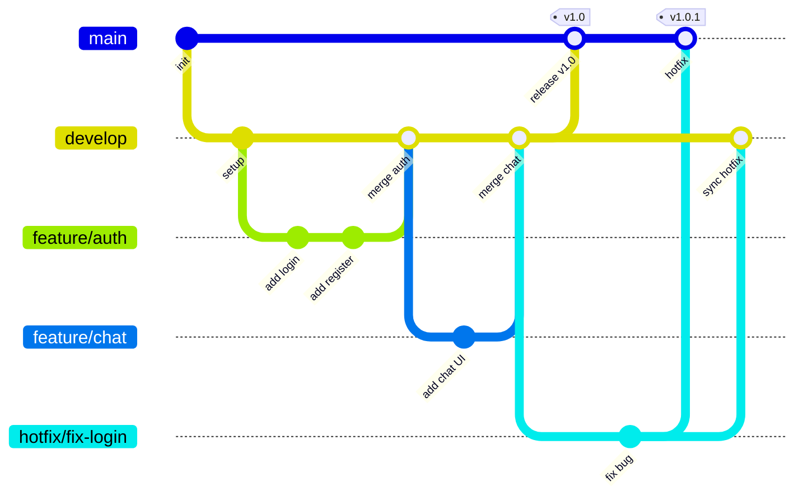

# Git Branching Strategy

## Branch Overview



## Branch Types

| Branch | Source | Merges Into | Naming | Purpose |
|--------|--------|-------------|--------|---------|
| `main` | — | — | `main` | **Production-ready** code. Every commit on `main` is deployable. |
| `develop` | `main` | `main` | `develop` | Integration branch where completed features are combined and tested before release. |
| `feature/*` | `develop` | `develop` | `feature/<short-description>` | New features or enhancements. |
| `bugfix/*` | `develop` | `develop` | `bugfix/<short-description>` | Non-critical bug fixes during development. |
| `hotfix/*` | `main` | `main` **and** `develop` | `hotfix/<short-description>` | Critical production bug fixes that cannot wait for the next release. |

---

## Branch Naming Convention

Use **lowercase kebab-case** after the prefix:

```
feature/user-authentication
feature/chat-integration
bugfix/fix-token-expiry
hotfix/fix-login-crash
```

> [!CAUTION]
> Do **not** use spaces, uppercase letters, or special characters in branch names.

---

## Workflow

### 1. Starting a New Feature

```bash
# Always branch from the latest develop
git checkout develop
git pull origin develop
git checkout -b feature/your-feature-name
```

### 2. Working on a Feature

- Make **small, focused commits** with clear messages (see [Commit Message Format](#commit-message-format) below).
- Push your branch regularly to the remote:
  ```bash
  git push origin feature/your-feature-name
  ```

### 3. Merging a Feature into `develop`

1. Open a **Pull Request** (PR) from `feature/*` → `develop`.
2. Request at least **1 reviewer**.
3. Ensure all CI checks pass.
4. **Squash and merge** or **merge commit** — the team should pick one strategy and stick with it.
5. Delete the feature branch after merging.

### 4. Releasing to Production

1. When `develop` is stable and ready for release:
   ```bash
   git checkout main
   git pull origin main
   git merge develop
   git tag -a v<version> -m "Release v<version>"
   git push origin main --tags
   ```
2. Alternatively, open a PR from `develop` → `main` for an additional review gate.

### 5. Hotfixes

For critical bugs found in production:

```bash
# Branch from main
git checkout main
git pull origin main
git checkout -b hotfix/describe-the-fix

# Fix the issue, then merge back into BOTH main and develop
```

1. PR `hotfix/*` → `main` — merge and tag a patch version.
2. PR `hotfix/*` → `develop` (or merge `main` into `develop`) — keep `develop` in sync.

---

## Commit Message Format

Follow the **Conventional Commits** format:

```
<type>(<scope>): <short summary>
```

### Types

| Type | When to Use |
|------|-------------|
| `feat` | A new feature |
| `fix` | A bug fix |
| `docs` | Documentation changes only |
| `style` | Code style changes (formatting, no logic change) |
| `refactor` | Code restructuring without changing behavior |
| `test` | Adding or updating tests |
| `chore` | Build config, dependencies, tooling |

### Examples

```
feat(auth): add Google OAuth login
fix(chat): resolve message ordering bug
docs(readme): update setup instructions
refactor(core): extract database helpers into utility module
```

> [!TIP]
> Keep the summary line under **72 characters**. Add a body separated by a blank line if more context is needed.

---

## Rules Summary

1. **Never commit directly to `main`** — all changes go through PRs.
2. **Keep `develop` stable** — only merge features that are complete and tested.
3. **Delete branches after merging** — avoid stale branches cluttering the repo.
4. **Tag every production release** on `main` with a semver tag (`v1.0.0`, `v1.0.1`, …).
5. **Hotfixes go to both `main` and `develop`** — never let them diverge.
