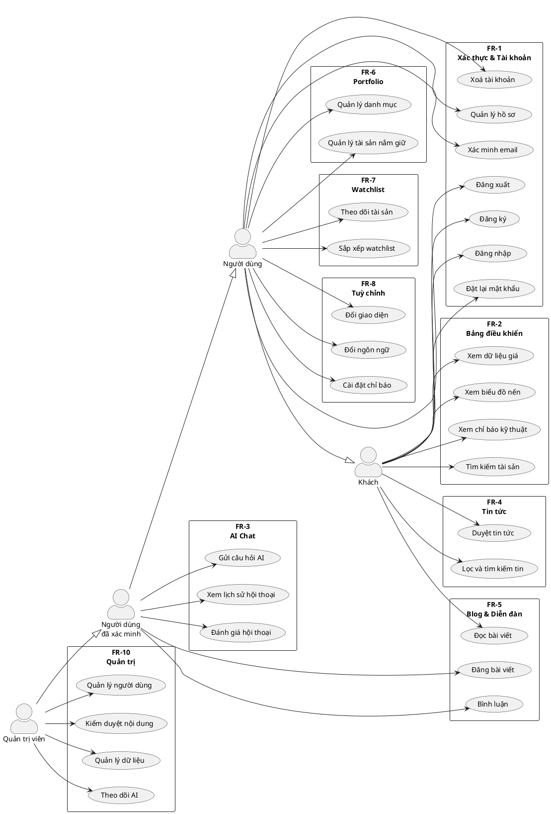

# 2.4 Sơ Đồ Use Case Tổng Quan

## Các tác nhân (Actors)

Hệ thống MarketMind xác định bốn tác nhân chính, được tổ chức theo cấp độ quyền truy cập tăng dần:

| Tác nhân | Mô tả | Điều kiện |
|---------|-------|-----------|
| **Khách** (Guest) | Người dùng chưa đăng nhập | Truy cập tự do |
| **Người dùng** (User) | Đã đăng nhập, chưa xác minh email | Có tài khoản, chưa nhấn link xác minh |
| **Người dùng đã xác minh** (Verified User) | Đã đăng nhập và xác minh email | Mở khóa đầy đủ tính năng |
| **Quản trị viên** (Admin) | Người dùng có `role = admin` | Được cấp quyền bởi admin khác |

Quan hệ kế thừa giữa các tác nhân:

```
Khách
  └── Người dùng (kế thừa Khách)
        └── Người dùng đã xác minh (kế thừa Người dùng)
              └── Quản trị viên (kế thừa Người dùng đã xác minh)
```

---

## Sơ đồ Use Case tổng quan



---

## Ma trận tác nhân – nhóm chức năng

Bảng dưới đây tóm tắt nhóm chức năng nào được truy cập bởi tác nhân nào:

| Nhóm chức năng | Khách | Người dùng | Người dùng đã xác minh | Quản trị viên |
|----------------|:-----:|:----------:|:----------------------:|:-------------:|
| FR-1: Xác thực & Tài khoản | ✅ (một phần) | ✅ | ✅ | ✅ |
| FR-2: Bảng điều khiển & Biểu đồ | ✅ | ✅ | ✅ | ✅ |
| FR-3: AI Chat | — | — | ✅ | ✅ |
| FR-4: Tin tức tài chính | ✅ | ✅ | ✅ | ✅ |
| FR-5: Blog & Diễn đàn (đọc) | ✅ | ✅ | ✅ | ✅ |
| FR-5: Blog & Diễn đàn (viết) | — | — | ✅ | ✅ |
| FR-6: Portfolio | — | ✅ | ✅ | ✅ |
| FR-7: Watchlist | — | ✅ | ✅ | ✅ |
| FR-8: Tuỳ chỉnh cá nhân | — | ✅ | ✅ | ✅ |
| FR-10: Quản trị hệ thống | — | — | — | ✅ |
