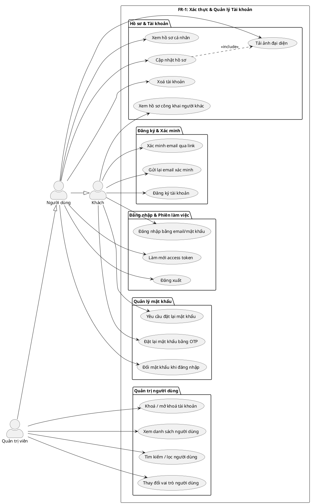
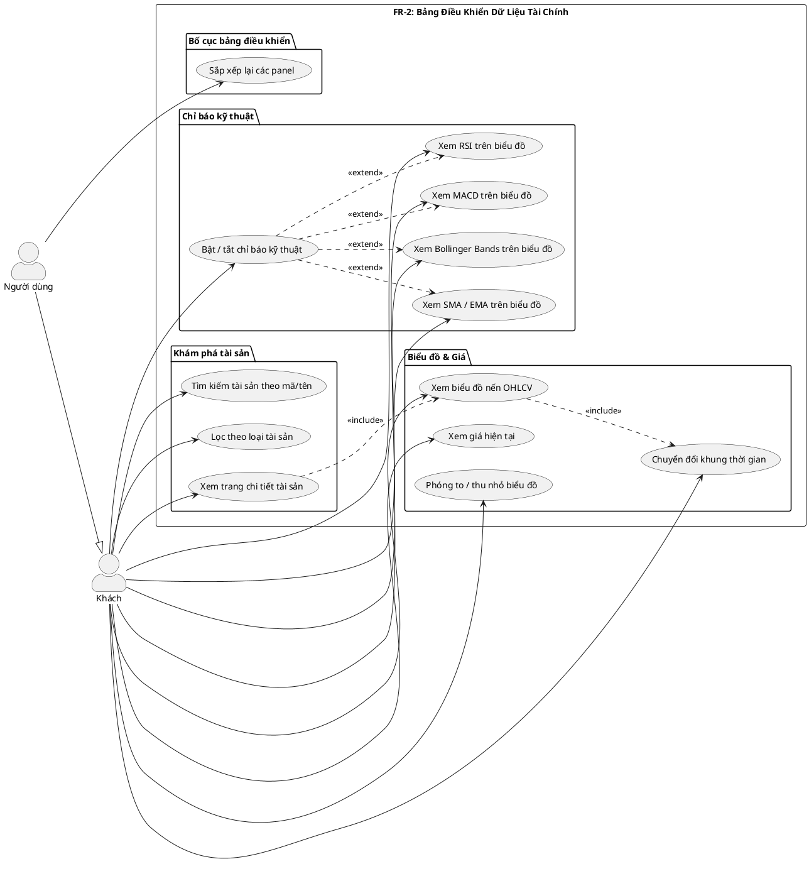
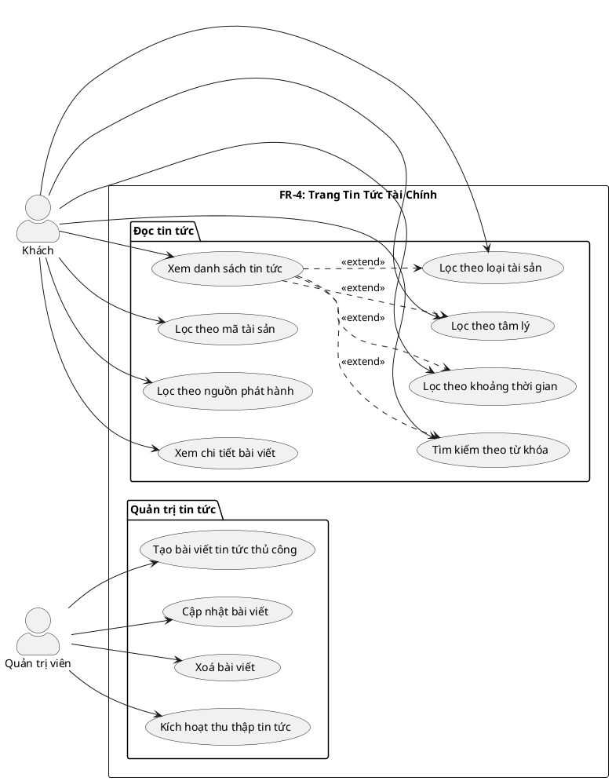
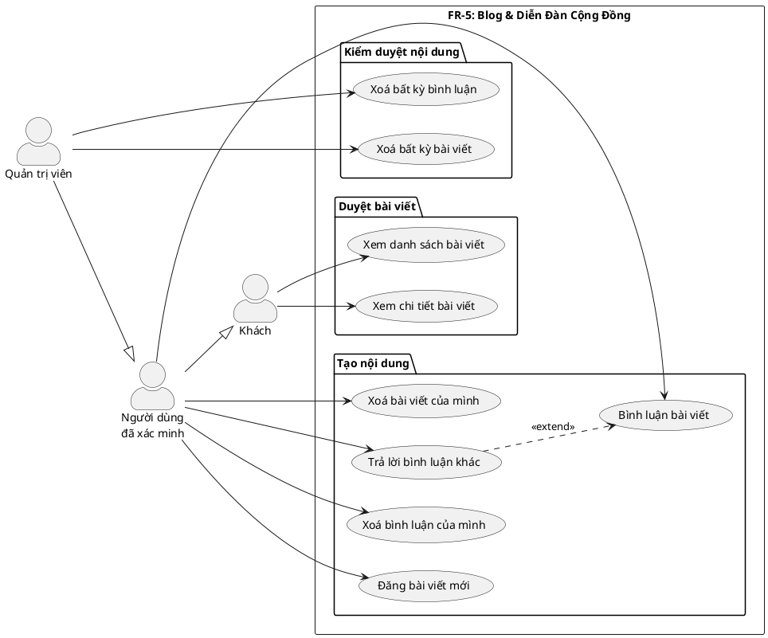
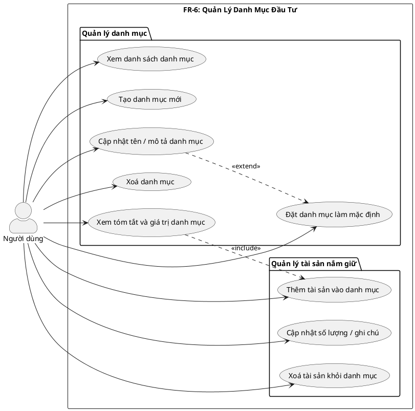
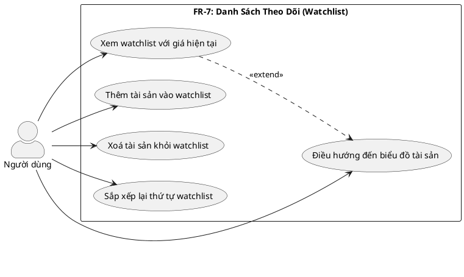
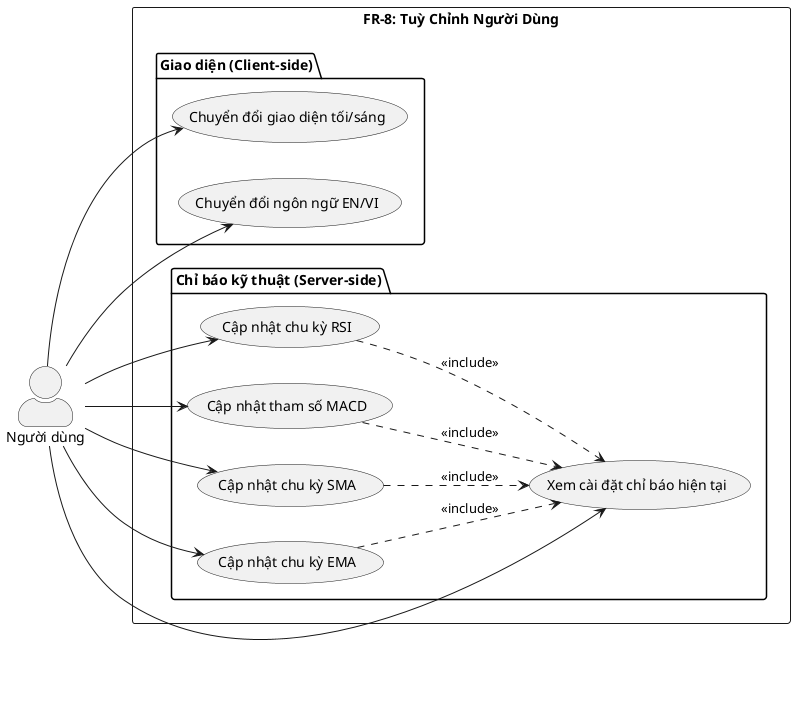
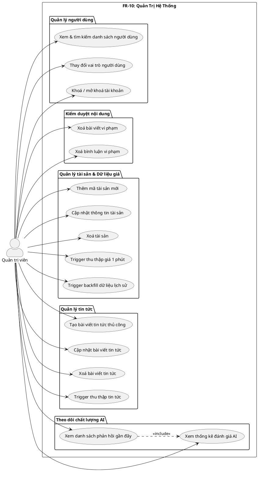

# 2.5 Sơ Đồ Use Case Chi Tiết

Phần này trình bày sơ đồ use case chi tiết cho từng nhóm chức năng, thể hiện đầy đủ các ca sử dụng đã được triển khai trong hệ thống.

---

## 2.5.1 FR-1: Xác thực và Quản lý Tài khoản



---

## 2.5.2 FR-2: Bảng Điều Khiển Dữ Liệu Tài Chính



---

## 2.5.3 FR-3: Giao Diện AI Chat

```plantuml
@startuml FR3_AIChat
left to right direction
skinparam actorStyle awesome

actor "Người dùng\nđã xác minh" as VUser
actor "Quản trị viên" as Admin

Admin --|> VUser

rectangle "FR-3: Giao Diện AI Chat" {

  package "Tương tác hội thoại" {
    (Gửi câu hỏi bằng ngôn ngữ tự nhiên) as UC_Send
    (Nhận phản hồi streaming (SSE)) as UC_Stream
    (Sử dụng nút Quick Action) as UC_QuickAction
    (Xem trạng thái routing intent) as UC_Routing
    (Xem công cụ AI đang thực thi) as UC_ToolVis
  }

  package "Quản lý hội thoại" {
    (Tạo hội thoại mới) as UC_NewConv
    (Xem danh sách hội thoại) as UC_ListConv
    (Xem lịch sử tin nhắn) as UC_History
    (Đổi tên hội thoại) as UC_Rename
    (Xoá hội thoại) as UC_Delete
  }

  package "Phản hồi chất lượng" {
    (Đánh giá hội thoại Like/Dislike) as UC_Rate
    (Gửi nhận xét văn bản) as UC_Feedback
  }

  package "Quản trị AI" {
    (Xem thống kê phản hồi AI) as UC_AdminStats
  }
}

VUser --> UC_Send
VUser --> UC_Stream
VUser --> UC_QuickAction
VUser --> UC_Routing
VUser --> UC_ToolVis
VUser --> UC_NewConv
VUser --> UC_ListConv
VUser --> UC_History
VUser --> UC_Rename
VUser --> UC_Delete
VUser --> UC_Rate
VUser --> UC_Feedback

Admin --> UC_AdminStats

UC_Send ..> UC_Stream : <<include>>
UC_Send ..> UC_Routing : <<include>>
UC_Rate ..> UC_Feedback : <<extend>>

@enduml
```

---

## 2.5.4 FR-4: Trang Tin Tức Tài Chính



---

## 2.5.5 FR-5: Blog và Diễn Đàn Cộng Đồng



---

## 2.5.6 FR-6: Quản Lý Danh Mục Đầu Tư (Portfolio)



---

## 2.5.7 FR-7: Danh Sách Theo Dõi (Watchlist)



---

## 2.5.8 FR-8: Tuỳ Chỉnh Người Dùng



---

## 2.5.9 FR-9: Xử Lý Lỗi và Dự Phòng

Nhóm FR-9 chủ yếu là hành vi của hệ thống (system behavior) chứ không phải ca sử dụng tương tác trực tiếp của người dùng. Các tình huống dự phòng được kích hoạt tự động khi phát sinh sự cố:

| Tình huống | Hành vi hệ thống | Trải nghiệm người dùng |
|-----------|-----------------|----------------------|
| API giá bên ngoài không khả dụng | Phục vụ từ Redis cache | Xem dữ liệu cũ, không bị lỗi |
| Gemini API lỗi giữa chừng | Phát SSE event `error`, rollback DB | Hiển thị thông báo lỗi, có thể thử lại |
| Celery task thất bại | Retry với exponential backoff (3 lần) | Không ảnh hưởng trực tiếp |
| Đầu vào không hợp lệ (Pydantic) | Trả về HTTP 422 với chi tiết lỗi theo trường | Nhận thông báo lỗi cụ thể |
| Token hết hạn | Trả về HTTP 401 | Frontend tự động làm mới token |
| Vượt giới hạn AI (20 req/60s) | Trả về HTTP 429 | Thông báo giới hạn và thời gian chờ |

---

## 2.5.10 FR-10: Quản Trị Hệ Thống



---

## Tổng hợp số lượng Use Case theo nhóm

| Nhóm chức năng | Số Use Case | Actors chính |
|----------------|:-----------:|-------------|
| FR-1: Xác thực & Tài khoản | 18 | Khách, Người dùng, Admin |
| FR-2: Bảng điều khiển | 11 | Khách, Người dùng |
| FR-3: AI Chat | 12 | Người dùng đã xác minh, Admin |
| FR-4: Tin tức | 8 | Khách, Admin |
| FR-5: Blog & Diễn đàn | 7 | Khách, Người dùng đã xác minh, Admin |
| FR-6: Portfolio | 9 | Người dùng |
| FR-7: Watchlist | 5 | Người dùng |
| FR-8: Tuỳ chỉnh | 7 | Người dùng |
| FR-9: Xử lý lỗi | Hành vi hệ thống | — |
| FR-10: Quản trị | 14 | Quản trị viên |
| **Tổng** | **91** | |
