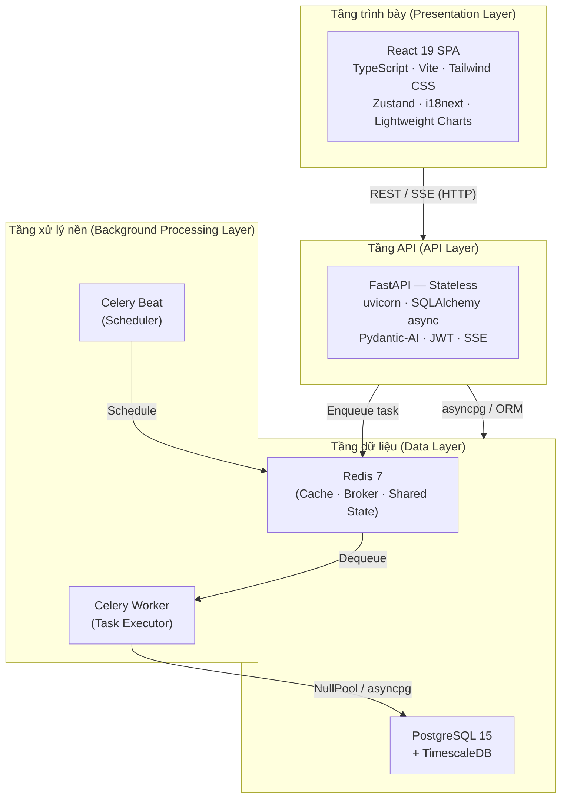

# 3.1.1 Phân Lớp Hệ Thống

MarketMind được tổ chức thành bốn tầng chức năng rõ ràng: tầng trình bày, tầng API, tầng xử lý nền, và tầng dữ liệu. Mỗi tầng có trách nhiệm đơn nhất (single responsibility), giao tiếp với tầng liền kề qua giao diện được định nghĩa rõ ràng, và có thể scale độc lập với nhau.

---

## Tầng trình bày — React SPA

Giao diện người dùng là một ứng dụng Single Page Application được đóng gói bằng Vite và phục vụ độc lập dưới dạng static files. Trình duyệt tải toàn bộ bundle JavaScript một lần khi truy cập lần đầu; từ đó mọi tương tác chỉ cần trao đổi dữ liệu JSON với backend mà không tải lại trang. Tầng này hoàn toàn tách biệt với backend — React SPA và FastAPI có thể deploy trên server khác nhau mà không cần thay đổi bất kỳ code nào.

Tầng trình bày giao tiếp với tầng API theo hai kênh:
- **REST (HTTP/JSON):** Cho toàn bộ thao tác CRUD thông thường — đăng nhập, lấy dữ liệu giá, quản lý portfolio, đọc tin tức.
- **SSE (Server-Sent Events):** Cho luồng AI chat — kết nối một chiều từ server xuống client, nhận từng token phản hồi của Gemini ngay khi sinh ra mà không cần polling.

Zustand quản lý global state (thông tin người dùng đăng nhập, dữ liệu thị trường đang xem). State tùy chỉnh giao diện (dark/light theme, ngôn ngữ) được persist vào `localStorage` qua Zustand middleware, áp dụng lại ngay khi tải trang mà không cần request server.

## Tầng API — FastAPI (Stateless)

FastAPI là điểm trung tâm duy nhất để tầng trình bày giao tiếp với phần còn lại của hệ thống. Ứng dụng được thiết kế **hoàn toàn stateless** — không có bất kỳ dữ liệu phiên hay cache nào được lưu trong bộ nhớ tiến trình (in-process memory). Toàn bộ state được ngoại hóa:

| State | Nơi lưu |
|-------|---------|
| Xác thực người dùng | JWT trong header — tự chứa (self-contained) |
| Token bị thu hồi (logout) | Redis blacklist với TTL |
| OTP đặt lại mật khẩu | Redis với TTL |
| Rate limit counter | Redis counter per user |

Thiết kế stateless cho phép chạy nhiều instance FastAPI song song (4 uvicorn worker trong production) phía sau một process manager mà không cần session stickiness — bất kỳ worker nào cũng có thể phục vụ bất kỳ request nào.

Khi người dùng gửi câu hỏi AI, FastAPI không xử lý trực tiếp trong request handler mà mở một SSE stream, gọi agent Pydantic-AI theo chế độ streaming, rồi forward từng token về client ngay khi Gemini sinh ra — giảm thời gian đến token đầu tiên (TTFT) xuống mức tối thiểu.

## Tầng xử lý nền — Celery

Celery tách biệt hoàn toàn khỏi tiến trình FastAPI. Các tác vụ nặng và định kỳ — thu thập dữ liệu giá 1 phút, backfill lịch sử, thu thập và phân tích tin tức — được đưa vào hàng đợi Redis và thực thi bởi Celery Worker trong tiến trình riêng. FastAPI chỉ cần enqueue task và trả lời client ngay; worker xử lý bất đồng bộ ở phía sau.

Cấu hình quan trọng của tầng này: Celery Worker **không chia sẻ connection pool** với FastAPI. Mỗi task tạo kết nối PostgreSQL mới qua `NullPool` và đóng ngay sau khi hoàn thành — tránh xung đột event loop giữa hai tiến trình độc lập.

Celery Beat đóng vai trò bộ lập lịch (scheduler) — ghi task vào Redis theo cron schedule đã cấu hình. Tách Beat ra container riêng đảm bảo lịch lập lịch không bị gián đoạn kể cả khi Worker được restart.

## Tầng dữ liệu — PostgreSQL + Redis

PostgreSQL với extension TimescaleDB đảm nhận lưu trữ toàn bộ dữ liệu có cấu trúc và bền vững: người dùng, portfolio, watchlist, bài viết blog, lịch sử hội thoại AI, và đặc biệt là bảng `price_data` — được tổ chức dưới dạng **hypertable** (tự động phân mảnh theo thời gian) thay vì bảng thông thường. Hypertable cho phép truy vấn theo khoảng thời gian và xóa dữ liệu cũ hiệu quả hơn nhiều khi dữ liệu tăng lên hàng chục triệu bản ghi.

Redis hoạt động song song với PostgreSQL và đảm nhận ba vai trò trong cùng một instance: cache dữ liệu giá (giảm tải truy vấn TimescaleDB lặp lại), message broker cho Celery (hàng đợi task), và shared state giữa các FastAPI instance (token blacklist, OTP, rate limit counter). Đây là thành phần **duy nhất có trạng thái chia sẻ** giữa nhiều instance API.
