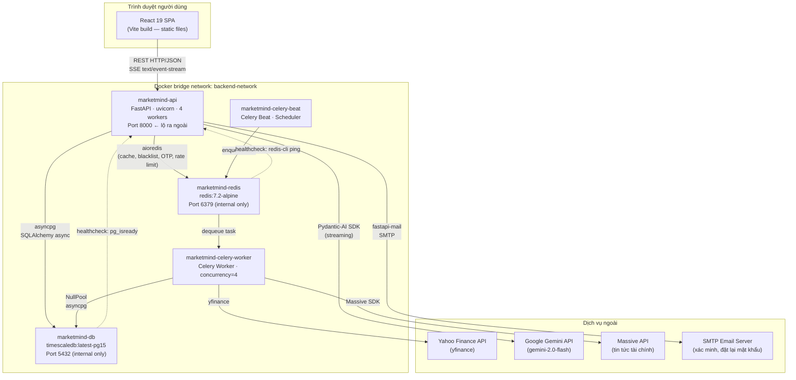
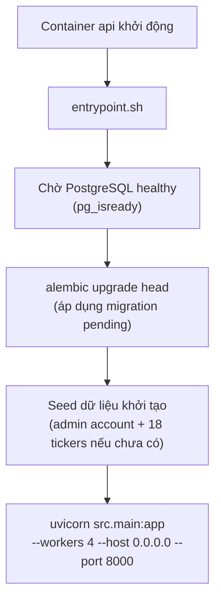

# 3.1.2 Sơ Đồ Triển Khai Tổng Quan

## Sơ đồ kiến trúc triển khai

Toàn bộ hệ thống backend được triển khai dưới dạng các Docker container, giao tiếp qua một Docker bridge network nội bộ (`backend-network`). Giao diện React SPA được phục vụ độc lập (static hosting hoặc container Nginx riêng). Luồng request từ trình duyệt đi qua API container duy nhất lộ ra ngoài — các container còn lại (DB, Redis) không có port map ra host trong production.



---

## Cấu hình container và phụ thuộc

Docker Compose định nghĩa health check cho cả PostgreSQL (`pg_isready`) và Redis (`redis-cli ping`). Container `api`, `celery-worker`, và `celery-beat` chỉ khởi động khi cả hai dependency này báo healthy — tránh lỗi kết nối khi DB hoặc Redis chưa sẵn sàng nhận kết nối.

| Container | Image / Build | Port | Vai trò |
|-----------|--------------|------|---------|
| `marketmind-api` | Multi-stage Dockerfile (production stage) | 8000 → host | FastAPI + uvicorn |
| `marketmind-celery-worker` | Cùng image với api | — | Xử lý task nền |
| `marketmind-celery-beat` | Cùng image với api | — | Lập lịch task |
| `marketmind-db` | `timescale/timescaledb:latest-pg15` | 5432 (internal) | Lưu trữ dữ liệu chính |
| `marketmind-redis` | `redis:7.2-alpine` | 6379 (internal) | Cache + broker + shared state |

Trong production, port của DB và Redis không được map ra host machine — chỉ các container trong cùng `backend-network` mới liên lạc được với nhau qua hostname nội bộ. Đây là biện pháp cô lập mạng cơ bản để tránh DB bị tiếp cận trực tiếp từ bên ngoài.

---

## Chiến lược Dockerfile (multi-stage build)

Dockerfile sử dụng ba stage độc lập để tối ưu kích thước image và tốc độ build:

```
Stage 1: base
  └── python:3.13-slim
  └── Cài uv (Astral package manager)
  └── uv sync --frozen (cài đúng phiên bản theo uv.lock)

Stage 2: dev  (kế thừa base)
  └── Mount source code qua volume
  └── uvicorn --reload  (hot-reload khi code thay đổi)

Stage 3: production  (kế thừa base)
  └── UV_COMPILE_BYTECODE=1  (biên dịch .pyc trước → khởi động nhanh hơn)
  └── Non-root user (appuser:appgroup, UID/GID 1001)
  └── uvicorn --workers 4  (4 process song song)
```

Multi-stage build đảm bảo image production không chứa tool dev (uv cache, build tools) và chạy với user không có quyền root — tuân thủ nguyên tắc least privilege.

---

## Luồng khởi động hệ thống

Khi container `api` khởi động, script `entrypoint.sh` thực hiện tuần tự ba bước trước khi chạy uvicorn:



Ba bước đầu được thiết kế **idempotent** — chạy nhiều lần không tạo dữ liệu trùng lặp hay gây lỗi. Điều này an toàn khi container bị restart bất ngờ.

---

## Hai môi trường triển khai

| Tiêu chí | Development (`docker-compose.dev.yml`) | Production (`docker-compose.prod.yml`) |
|---------|----------------------------------------|----------------------------------------|
| Source code | Mount volume `./src` → `/app/src` | Copy vào image khi build |
| Hot-reload | `uvicorn --reload` | `uvicorn --workers 4` |
| DB port | 5433 → host (để kết nối qua DataGrip) | Internal only |
| Redis port | 6380 → host (để debug) | Internal only |
| Bytecode | Không | `UV_COMPILE_BYTECODE=1` |
| User | root (tiện dev) | Non-root appuser |
| Resource limits | Không giới hạn | CPU/RAM limits per container |
| Restart policy | Không | `restart: always` |
