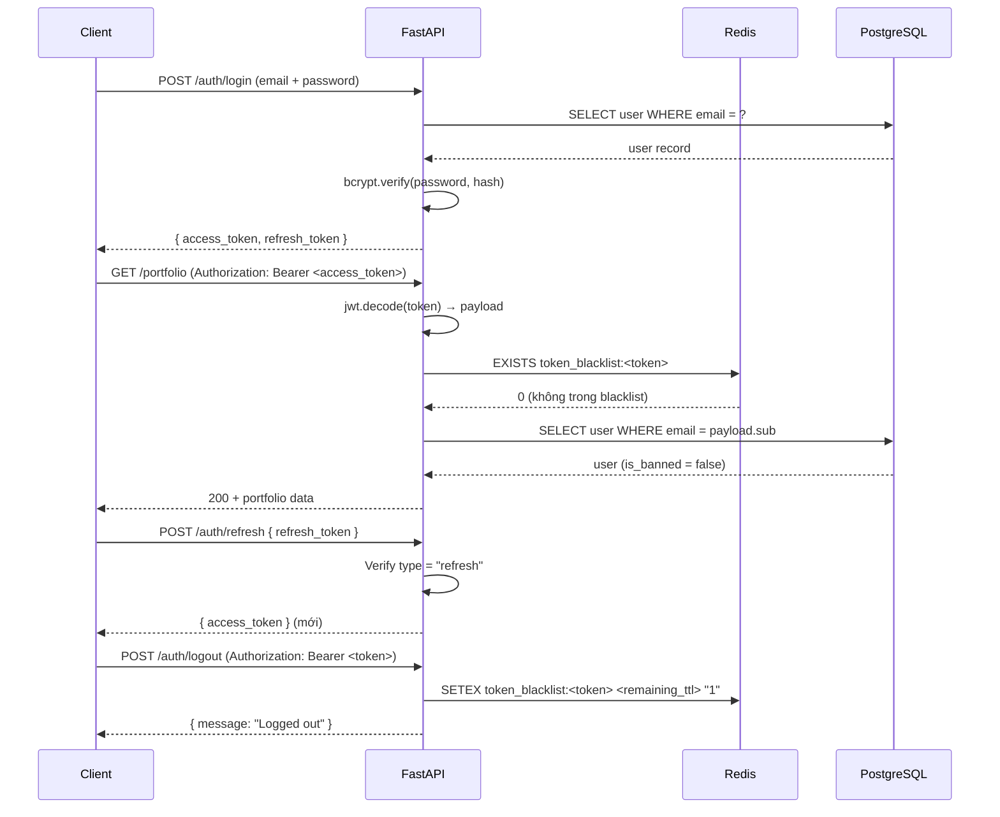

# 3.4.2 Cơ Chế Xác Thực JWT (Access Token + Refresh Token + Blacklist)

## Tổng quan

Hệ thống sử dụng ba loại JWT riêng biệt cho ba mục đích khác nhau, tất cả đều ký bằng thuật toán **HS256** (HMAC-SHA256) với cùng `SECRET_KEY`. Trường `type` trong payload phân biệt loại token — mỗi endpoint kiểm tra `type` trước khi xử lý, ngăn dùng lẫn token.

| Loại token | Thời hạn | Trường `type` | Mục đích |
|-----------|---------|--------------|---------|
| Access token | 30 phút | `"access"` | Xác thực mọi request yêu cầu Auth |
| Refresh token | 7 ngày | `"refresh"` | Cấp access token mới khi hết hạn |
| Verify token | 24 giờ | `"verification"` | Link xác minh email một lần |

---

## Cấu trúc JWT payload

### Access token

```json
{
  "sub": "user@example.com",
  "exp": 1748000000,
  "type": "access"
}
```

`sub` là email người dùng — dùng để tra cứu user trong DB tại mỗi request. Access token **không chứa role hay thông tin phân quyền** — quyết định phân quyền luôn được thực hiện bằng cách đọc `user.role` từ DB, tránh stale authorization nếu role thay đổi trong thời gian token còn hiệu lực.

### Refresh token

```json
{
  "sub": "user@example.com",
  "exp": 1748604800,
  "type": "refresh"
}
```

Refresh token chỉ được chấp nhận tại endpoint `/auth/refresh` — bị từ chối nếu gửi đến bất kỳ endpoint nào khác (kiểm tra trường `type`).

---

## Luồng xác thực đầy đủ



---

## Dependency `get_current_user`

FastAPI's dependency injection được dùng để tập trung toàn bộ logic xác thực vào một hàm duy nhất:

```python
async def get_current_user(db, cred: HTTPAuthorizationCredentials):
    # 1. Kiểm tra Bearer scheme
    token = cred.credentials
    
    # 2. Decode và kiểm tra type = "access"
    payload = decode_token(token)
    
    # 3. Kiểm tra blacklist Redis
    if await redis.exists(f"token_blacklist:{token}"):
        raise InvalidToken()
    
    # 4. Tra cứu user từ DB
    user = await db.get(User, email=payload["sub"])
    
    # 5. Kiểm tra is_banned
    if user.is_banned:
        raise UserBanned()
    
    return user
```

Các endpoint chỉ cần khai báo `current_user: User = Depends(get_current_user)` — FastAPI tự động inject và thực thi toàn bộ chuỗi kiểm tra trên trước khi handler chạy.

```python
# Admin dependency xếp chồng lên get_current_user:
async def get_admin_user(current_user = Depends(get_current_user)):
    if current_user.role != "admin":
        raise InsufficientPermissions()
    return current_user
```

---

## Cơ chế Blacklist (Logout)

JWT là stateless — một khi đã ký, không thể "hủy" token trước khi hết hạn theo cơ chế tiêu chuẩn. Hệ thống giải quyết bằng **blacklist trong Redis**:

```
Khi logout:
  SETEX token_blacklist:<access_token> <remaining_seconds> "1"

Khi xác thực:
  EXISTS token_blacklist:<access_token>
  → Có: từ chối (token đã bị logout)
  → Không: cho qua
```

TTL của key Redis bằng chính xác số giây còn lại của token (`exp - now`). Khi token hết hạn tự nhiên, key Redis cũng tự xóa — không tích lũy dữ liệu thừa.

Refresh token **không có blacklist** — khi access token hết hạn và user đã logout, refresh token vô dụng vì endpoint `/auth/refresh` vẫn tạo access token mới nhưng các request kèm access token đó sẽ bị chặn. Đây là trade-off chấp nhận được: refresh token không tạo ra request thực tế, chỉ cấp access token mới — và access token mới đó sẽ hợp lệ theo đúng cơ chế bình thường.

---

## Bảo vệ chống email enumeration

Endpoint `/auth/forget-password` luôn trả về cùng một thông điệp thành công dù email có tồn tại hay không:

```json
{ "message": "If this email is registered, you will receive a reset code shortly." }
```

Điều này ngăn attacker dò tìm email nào đã đăng ký bằng cách quan sát response khác nhau.

---

## Token OTP đặt lại mật khẩu

OTP cho quá trình đặt lại mật khẩu không phải JWT — đây là chuỗi ngắn ngẫu nhiên lưu trong Redis:

```
SETEX reset_otp:<email> 900 "<otp_code>"   ← TTL 15 phút
```

Sau khi OTP được xác nhận thành công:
```
DEL reset_otp:<email>   ← Vô hiệu hóa ngay, không dùng được lần hai
```

OTP chỉ tồn tại trong Redis — không lưu DB, không log, không xuất hiện trong response sau khi gửi.
