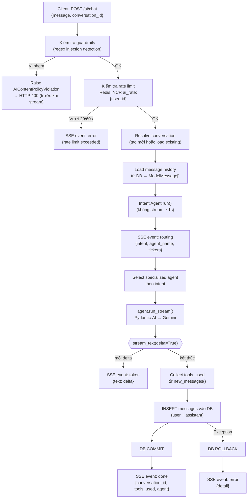

# 3.4.3 SSE Streaming cho AI Chat

## Tại sao dùng SSE thay vì WebSocket

AI Chat là tính năng duy nhất trong MarketMind dùng kết nối streaming liên tục. SSE (Server-Sent Events) được chọn thay vì WebSocket vì:

| Tiêu chí | WebSocket | SSE |
|---------|-----------|-----|
| Hướng truyền | Song chiều | Một chiều (server → client) |
| Giao thức | Upgrade handshake riêng | HTTP/1.1 thông thường |
| Tương thích proxy/CDN | Cần cấu hình thêm | Hoạt động qua mọi HTTP proxy |
| Tự động kết nối lại | Phải tự implement | Trình duyệt tự xử lý |
| Phù hợp AI chat | Dư thừa (client gửi ít) | Đủ — client gửi 1 request, server stream nhiều token |

AI Chat chỉ cần server truyền dữ liệu về client (token stream) — không cần kênh song chiều. SSE đơn giản hơn, không cần upgrade giao thức, và hoạt động qua mọi reverse proxy mà không cần cấu hình đặc biệt.

---

## Cấu trúc SSE response

Endpoint `/ai/chat` là `POST` (không phải `GET` như SSE truyền thống) vì cần nhận payload JSON trong body (tin nhắn + `conversation_id`). FastAPI trả về `StreamingResponse` với `media_type="text/event-stream"`:

```
HTTP/1.1 200 OK
Content-Type: text/event-stream
Cache-Control: no-cache
X-Accel-Buffering: no
```

Header `X-Accel-Buffering: no` yêu cầu nginx (nếu có) không buffer response — đảm bảo mỗi SSE event được gửi đến client ngay lập tức.

Mỗi SSE event có định dạng:

```
event: <tên_event>\n
data: <JSON string>\n
\n
```

---

## Các SSE event được phát ra

Hệ thống phát ra 4 loại event theo thứ tự:

### 1. `routing` — Phân loại intent

```json
event: routing
data: {
  "intent": "market_analysis",
  "agent_name": "Trợ lý Phân tích thị trường",
  "tickers": ["AAPL", "NVDA"]
}
```

Được phát ngay sau khi Intent Agent phân loại xong (~1 giây). Client dùng event này để hiển thị tên agent đang xử lý cho user biết trước khi token đầu tiên đến.

### 2. `token` — Token văn bản

```json
event: token
data: { "text": "Dựa trên" }
```

```json
event: token
data: { "text": " dữ liệu" }
```

Mỗi event chứa một delta văn bản nhỏ (thường 1–5 từ) sinh bởi Gemini. Client nối dần các delta để hiển thị văn bản đang gõ. Số lượng event `token` dao động từ vài chục đến vài trăm tùy độ dài câu trả lời.

### 3. `done` — Hoàn thành

```json
event: done
data: {
  "conversation_id": "550e8400-e29b-41d4-a716-446655440000",
  "tools_used": ["get_price_history", "compute_rsi"],
  "agent": "market_analysis"
}
```

Được phát sau khi toàn bộ phản hồi đã được stream và tin nhắn đã được commit vào DB. Client dùng `conversation_id` để lưu lại ID hội thoại nếu đây là turn đầu tiên (conversation mới).

### 4. `error` — Lỗi

```json
event: error
data: { "detail": "Bạn đã vượt giới hạn 20 câu hỏi trong 60 giây." }
```

Được phát khi có lỗi ở bất kỳ bước nào (rate limit, guardrail, lỗi Gemini API, lỗi DB). DB rollback trước khi phát event này — không có tin nhắn nửa vời nào được lưu.

---

## Luồng xử lý đầy đủ



---

## Quản lý DB session trong SSE

DB session được mở trước khi bắt đầu generator và đóng khi generator kết thúc. Đây là điểm khác biệt quan trọng với request thông thường: session sống lâu hơn nhiều (toàn bộ thời gian streaming thay vì vài millisecond).

Chiến lược commit:
- **Không commit trong khi streaming** — chỉ commit sau khi toàn bộ phản hồi AI hoàn thành và cả hai tin nhắn (user + assistant) đã được thêm vào session.
- **Rollback khi có exception** — bất kỳ lỗi nào ở bất kỳ bước nào đều trigger rollback trước khi phát event `error`. Không có trạng thái trung gian nào được persist.

---

## Phía client — Nhận SSE

```typescript
// Frontend (React) nhận SSE qua fetch + ReadableStream
const response = await fetch('/ai/chat', {
    method: 'POST',
    headers: { 'Authorization': `Bearer ${token}` },
    body: JSON.stringify({ message, conversation_id }),
});

const reader = response.body!.getReader();
const decoder = new TextDecoder();

while (true) {
    const { done, value } = await reader.read();
    if (done) break;
    
    const text = decoder.decode(value);
    // Parse event type và data từ text/event-stream format
    // Append token vào UI state khi nhận event "token"
}
```

Client parse từng chunk text theo định dạng SSE (`event:` + `data:` lines), sau đó cập nhật React state để render token mới vào giao diện chat. Kết quả là hiệu ứng "đang gõ" — người dùng thấy phản hồi xuất hiện dần dần thay vì chờ toàn bộ câu trả lời.
