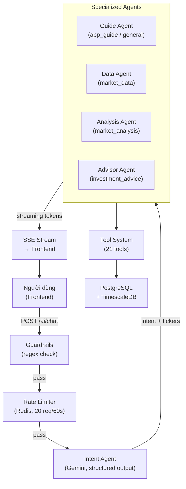

# 3.5.1 Tổng Quan Kiến Trúc Multi-Agent

MarketMind triển khai hệ thống AI dưới dạng kiến trúc **multi-agent với hai tầng**: một Intent Agent phân loại yêu cầu ở đầu vào, và bốn Specialized Agent xử lý từng miền chuyên biệt ở tầng thứ hai. Toàn bộ hệ thống được xây dựng trên thư viện **Pydantic-AI**, gọi **Google Gemini** làm nền tảng ngôn ngữ, và giao tiếp với frontend qua **SSE (Server-Sent Events)** để streaming từng token phản hồi.



---

## Luồng xử lý hai pha

Mỗi yêu cầu chat đi qua **hai pha tuần tự**:

**Pha 1 — Phân loại (không stream, ~1 giây):** Intent Agent nhận tin nhắn của người dùng, phân tích và trả về một đối tượng `IntentResult` có cấu trúc gồm ba trường: `intent` (loại yêu cầu), `tickers` (danh sách mã chứng khoán được đề cập), và `language` (ngôn ngữ đang dùng). Ngay sau khi có kết quả phân loại, server gửi SSE event `routing` về client để frontend có thể hiển thị tên agent đang xử lý — ví dụ "Trợ lý Dữ liệu thị trường" — trước khi phản hồi đầy đủ xuất hiện.

**Pha 2 — Xử lý và streaming:** Dựa trên `intent` từ Pha 1, router chọn đúng Specialized Agent và gọi `agent.run_stream()`. Từng delta text được forward ngay về client qua SSE event `token`. Sau khi stream kết thúc, server lưu cặp tin nhắn (user + assistant) vào database và gửi SSE event `done` kèm metadata.

## Thiết kế stateless và dependency injection

Tất cả Specialized Agent đều nhận một `AgentDeps` object được inject qua Pydantic-AI's `RunContext`:

```python
@dataclass
class AgentDeps:
    db: AsyncSession   # phiên database của request hiện tại
    user_id: uuid.UUID # định danh người dùng, dùng để truy cập portfolio/watchlist
```

Nhờ đó mỗi tool call trong agent luôn có đầy đủ ngữ cảnh (kết nối DB, user_id) mà không cần biến toàn cục — phù hợp với mô hình stateless của FastAPI.

## Quản lý lịch sử hội thoại

Để agent hiểu ngữ cảnh của các tin nhắn follow-up ngắn (ví dụ "Xác nhận", "100 cổ", "OK"), router lấy toàn bộ lịch sử tin nhắn từ database và chuyển đổi sang định dạng `ModelMessage` của Pydantic-AI. Với Intent Agent, chỉ 4 tin nhắn gần nhất được truyền vào (giảm token và tăng tốc phân loại); với Specialized Agent, toàn bộ lịch sử được truyền vào để đảm bảo tính mạch lạc trong hội thoại dài.

## Singleton agent với `lru_cache`

Mỗi trong 5 agent được khởi tạo một lần duy nhất (sử dụng `@lru_cache(maxsize=1)` cho getter function) và tái sử dụng xuyên suốt vòng đời ứng dụng. Cách này tránh tạo lại đối tượng `Agent` (bao gồm cả việc load `app_guide.md` cho Guide Agent) với mỗi request, đồng thời đảm bảo thread-safety vì các Pydantic-AI agent là immutable sau khi khởi tạo.
