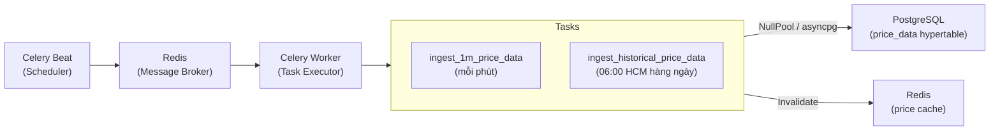

# 3.6.1 Pipeline Thu Thập Giá (Celery Beat + yfinance)

Pipeline thu thập dữ liệu giá của MarketMind được xây dựng trên **Celery Beat** làm bộ lập lịch và **yfinance** làm nguồn dữ liệu. Hệ thống vận hành hai task độc lập: ingestion 1 phút để cập nhật real-time, và backfill lịch sử để duy trì độ sâu dữ liệu cho các timeframe dài.

## Kiến trúc hai task



---

## Task 1: Ingestion 1 phút (`ingest_1m_price_data`)

**Lịch chạy:** Mỗi phút (`crontab(minute="*")`).

**Quy trình:**

1. Truy vấn tất cả asset đang active (`is_active=True`) từ bảng `assets`.
2. Chia danh sách ticker thành batch 50 ticker, tải dữ liệu từ yfinance với `period="7d"`, `interval="1m"`.
3. Với mỗi ticker trong batch, chuyển đổi DataFrame thành danh sách record dict.
4. INSERT dữ liệu vào bảng `price_data` theo chunk 2000 rows, sử dụng `ON CONFLICT DO UPDATE` để cập nhật nến đang trong tiến trình.
5. Sau khi commit, invalidate Redis cache cho các ticker vừa được cập nhật.

**Xử lý lỗi:** Mỗi lần download yfinance được thử tối đa 3 lần (exponential backoff: 2s, 4s). Nếu thất bại sau 3 lần, exception được raise và Celery ghi log lỗi — task lần này bỏ qua, lần sau (1 phút tới) sẽ thử lại.

**Chiến lược conflict:** 1m task dùng `ON CONFLICT DO UPDATE` vì nến hiện tại (candle đang hình thành) cần được cập nhật mỗi phút — giá close thay đổi liên tục cho đến khi nến đóng. Nếu dùng `DO NOTHING`, nến sẽ bị đóng băng tại giá trị đầu tiên.

---

## Task 2: Historical Backfill (`ingest_historical_price_data`)

**Lịch chạy:** 06:00 HCM hàng ngày (`crontab(hour=6, minute=0)`), hoặc khi admin trigger qua `POST /price/backfill`.

**Các timeframe được backfill:**

| yfinance interval | yfinance period | DB timeframe | Lý do |
|-------------------|-----------------|--------------|-------|
| `1h` | `730d` | `1h` | Base cho 4h và 1d (aggregated on-the-fly) |
| `30m` | `60d` | `30m` | Tối đa yfinance hỗ trợ cho 30m |
| `15m` | `60d` | `15m` | Tối đa yfinance hỗ trợ cho 15m |
| `5m` | `60d` | `5m` | Tối đa yfinance hỗ trợ cho 5m |
| `1m` | `7d` | `1m` | Hard limit của yfinance cho 1m |

**Chiến lược conflict:** Historical task dùng `ON CONFLICT DO NOTHING` — dữ liệu lịch sử đã xác nhận không nên bị ghi đè. Chỉ các bản ghi hoàn toàn mới được insert, tránh làm thay đổi dữ liệu cũ đã ổn định.

**Xử lý theo từng ticker:** Không batch nhiều ticker cùng lúc (khác với 1m task) vì khoảng thời gian tải dài và dữ liệu lớn — tải từng ticker tuần tự, retry 3 lần với exponential backoff khi thất bại.

---

## Thiết kế NullPool cho Celery Worker

Celery Worker chạy trong tiến trình riêng, tách biệt hoàn toàn với FastAPI. Mỗi task tạo kết nối database qua `TaskSessionLocal` — được cấu hình với `NullPool` (không connection pooling):

```python
_task_engine = create_async_engine(DATABASE_URL, poolclass=NullPool)
TaskSessionLocal = async_sessionmaker(bind=_task_engine, ...)
```

Lý do: `asyncio.run()` trong mỗi Celery task tạo một event loop mới. Các kết nối asyncpg bị gắn với event loop tạo ra chúng — tái sử dụng chúng từ loop khác gây lỗi. `NullPool` đảm bảo mỗi task mở kết nối mới và đóng ngay sau khi hoàn thành.

---

## Invalidation Redis cache sau mỗi ingestion

Sau khi insert thành công, cả hai task xóa các key Redis tương ứng:

- `price:history:{ticker}:*` — tất cả cached history của ticker (mọi timeframe)
- `price:latest:{ticker}` — cached giá mới nhất

Celery Worker không dùng Redis client của FastAPI (chỉ khởi tạo khi FastAPI khởi động). Thay vào đó, task tạo một kết nối Redis mới (`redis.asyncio.from_url()`), xóa cache, rồi đóng kết nối ngay. Lỗi trong bước này được log nhưng không làm task thất bại — cache invalidation là best-effort.
