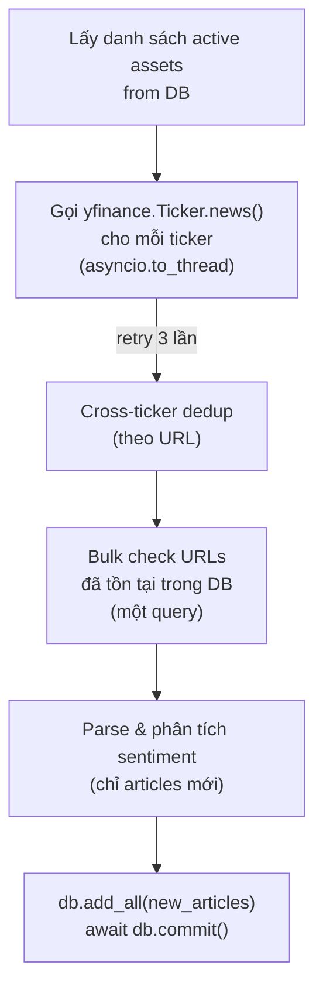

# 3.6.2 Pipeline Thu Thập và Phân Tích Tin Tức

Pipeline tin tức của MarketMind tự động thu thập, lọc trùng lặp, phân tích sentiment và lưu trữ tin tức tài chính từ yfinance theo lịch định kỳ. Toàn bộ quy trình được thực thi bởi Celery Worker với bốn lần chạy mỗi ngày, điều chỉnh để phủ kịp thời điểm mở/đóng cửa thị trường chứng khoán Mỹ.

## Lịch thu thập

```
Mỗi 3 giờ   (*/3)           — Refresh nền, tránh vượt rate limit Yahoo
NYSE mở cửa (20:30 HCM)     — Tương đương 09:30 ET (mùa hè/EDT)
NYSE đóng cửa (03:00 HCM)   — Tương đương 16:00 ET (mùa hè/EDT)
```

Ba lần chạy ngoài lịch định kỳ được thêm vào để đảm bảo tin tức quan trọng xung quanh thời điểm giao dịch (pre-market, after-hours) được cập nhật kịp thời.

## Quy trình thu thập (`ingest_assets_news`)



**Bước 1 — Resolve tickers:** Truy vấn toàn bộ asset active, xây dựng mapping `ticker → category` (stock, crypto, macro...) dựa trên `asset_type` của từng asset.

**Bước 2 — Fetch từ yfinance:** Gọi `get_tickers_news()` trong thread riêng (`asyncio.to_thread`) vì yfinance là thư viện blocking. Trả về danh sách `(source_ticker, raw_item)` pairs, đã dedup nội bộ theo URL khi một bài xuất hiện cho nhiều ticker.

**Bước 3 — Bulk dedup:** Lấy toàn bộ URL của các bài tin vừa fetch, kiểm tra một lần với PostgreSQL (`WHERE url IN (...)`). Tránh N+1 queries bằng cách xây dựng `set` các URL đã tồn tại rồi filter trong Python.

**Bước 4 — Parse và lưu:** Chỉ xử lý bài chưa có trong DB. Mỗi bài được parse thành `NewsArticle` object kèm phân tích sentiment ngay tại bước này. Sau đó `db.add_all()` lưu toàn bộ bài mới trong một transaction.

## Phân tích Sentiment với Loughran-McDonald + VADER

Sentiment của mỗi bài tin được tính ngay khi parse, trước khi lưu vào database. Hệ thống kết hợp hai công cụ:

**VADER (Valence Aware Dictionary and sEntiment Reasoner):**
- Xử lý đặc điểm ngôn ngữ: phủ định ("not profitable" → negative), intensifiers ("record-breaking" → mạnh hơn), dấu câu và chữ hoa.
- Mặc định được huấn luyện trên mạng xã hội — một số thuật ngữ tài chính có điểm không phù hợp.

**Loughran-McDonald Master Dictionary:**
- Từ điển tài chính chuyên biệt ~2700 từ, phân loại từ hồ sơ SEC filings nghiên cứu từ 1993-2025.
- Phân loại: Negative (-2.0), Positive (+2.0), Uncertainty (-0.75), Litigious (-1.0), Constraining (-0.5).
- Được nạp vào lexicon của VADER, ghi đè các từ tài chính lên điểm mặc định của VADER.

**Manual overrides:** Thêm điểm số được fine-tune thủ công cho ~50 từ có tín hiệu mạnh trong tài chính:

| Từ | Điểm | Lý do |
|----|------|-------|
| `bankruptcy` | -3.5 | Mạnh hơn LM base |
| `fraud` | -3.5 | Tín hiệu tiêu cực rất mạnh |
| `beat` / `beats` | +2.5 | Vượt kỳ vọng earnings |
| `upgrade` | +2.5 | Nâng hạng cổ phiếu |
| `surge` / `soared` | +2.0 | Giá tăng mạnh |

**Ngưỡng phân loại (VADER standard):**
- `score ≥ +0.05` → **BULLISH**
- `score ≤ -0.05` → **BEARISH**
- `otherwise` → **NEUTRAL**

Kết quả `(label, score)` được lưu vào hai trường `sentiment_label` và `sentiment_score` của bảng `news_articles`.

## Xử lý trùng lặp đa cấp

Một bài tin tài chính thường xuất hiện liên quan đến nhiều ticker (ví dụ tin về S&P 500 liên quan đến AAPL, MSFT, GOOGL cùng lúc). Pipeline xử lý trùng lặp ở ba cấp:

1. **Intra-batch dedup:** Khi một URL xuất hiện lần đầu trong batch hiện tại, thêm vào `existing_urls` set để các lần gặp sau không được thêm vào `new_articles`.
2. **Cross-DB dedup:** `set` các URL đã có trong database được xây dựng từ một bulk query trước khi parse — bài đã lưu từ lần chạy trước không được thêm lại.
3. **Database constraint:** Cột `url` trong bảng `news_articles` có constraint `UNIQUE` — ngay cả khi hai luồng chạy song song, database sẽ từ chối insert trùng.

Quan hệ giữa bài tin và ticker được lưu riêng trong bảng `news_article_tickers` với trường `ticker` dạng string (không FK đến `assets`) — một bài có thể gắn với nhiều ticker, và có thể gắn với ticker chưa có trong `assets`.
