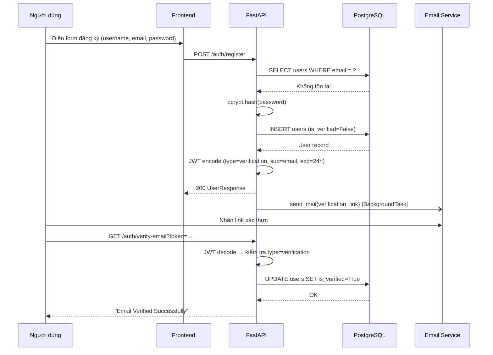
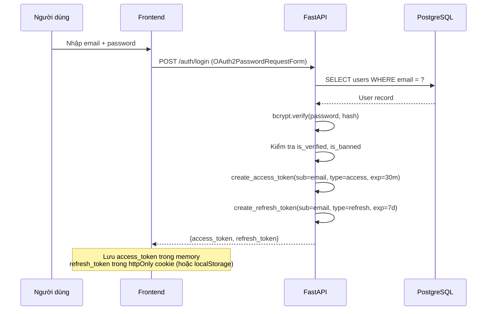
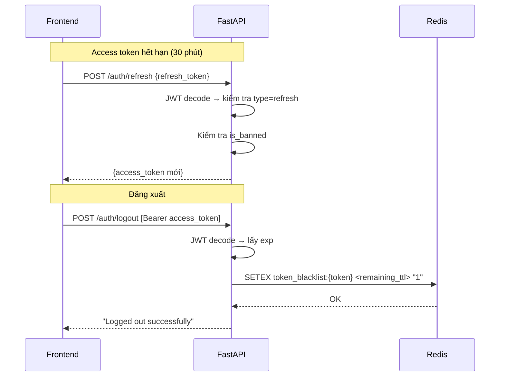
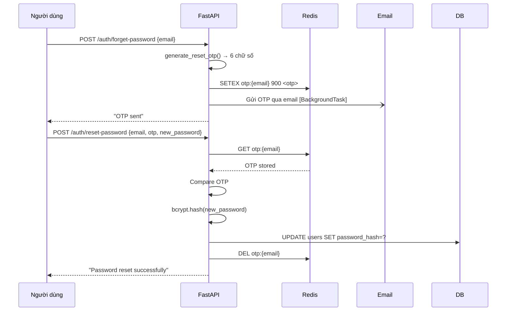

# 3.7.1 Luồng Đăng Ký và Xác Thực

MarketMind triển khai xác thực dựa trên **JWT stateless** với ba loại token: access token (ngắn hạn), refresh token (dài hạn), và verify token (xác thực email). Phiên đăng nhập không được lưu trong server — toàn bộ trạng thái xác thực được mang trong token hoặc Redis.

## Luồng đăng ký tài khoản

**Email gửi bất đồng bộ:** `send_mail` được đưa vào `BackgroundTasks` của FastAPI — API trả về ngay lập tức mà không chờ email gửi xong, tránh làm tăng latency đăng ký.

**Verify token:** JWT riêng với `type: "verification"` và TTL 24 giờ. Khi người dùng click link, token được decode và kiểm tra `type` trước khi cập nhật `is_verified`.

---

## Luồng đăng nhập và cấp token

**Kiểm tra trước khi cấp token:** Ba điều kiện theo thứ tự — (1) email tồn tại, (2) password đúng (`bcrypt.verify`), (3) tài khoản đã xác thực email (`is_verified=True`), (4) tài khoản không bị ban (`is_banned=False`). Lỗi ở bước nào trả về HTTP exception ngay tại bước đó.

---

## Luồng làm mới token và đăng xuất

**Blacklist access token:** Khi logout, access token bị đưa vào Redis blacklist với TTL bằng thời gian còn lại trước khi token hết hạn. Middleware xác thực (`get_current_user`) kiểm tra blacklist với mỗi request — nếu token có trong blacklist, từ chối dù token chưa hết hạn về mặt kỹ thuật.

**Refresh token không có blacklist:** Refresh token không được thu hồi khi logout — đây là trade-off được chấp nhận. Token có TTL 7 ngày và chỉ dùng để lấy access token mới, không trực tiếp truy cập tài nguyên. Trong ngữ cảnh ứng dụng tài chính đọc/ghi dữ liệu cá nhân, rủi ro này được coi là chấp nhận được.

---

## Luồng quên mật khẩu (OTP)

OTP 6 chữ số được lưu trong Redis với TTL 900 giây (15 phút). Sau khi reset thành công, key OTP bị xóa ngay để không thể tái sử dụng.
