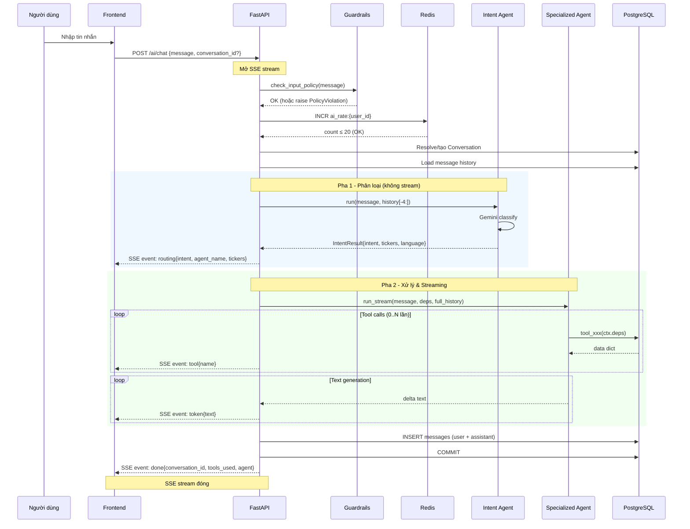

# 3.7.2 Luồng AI Chat (SSE Streaming + Tool Execution)

Luồng AI chat là nghiệp vụ phức tạp nhất trong MarketMind, kết hợp bốn thành phần: guardrails, Intent Agent, Specialized Agent với tool calls, và SSE streaming. Toàn bộ diễn ra trong một HTTP request duy nhất mở kết nối SSE.

## Tổng quan sơ đồ tuần tự



## Chi tiết từng SSE event

| Event | Thời điểm | Payload |
|-------|-----------|---------|
| `routing` | Sau Intent Agent | `{intent, agent_name, tickers}` |
| `tool` | Mỗi khi agent gọi tool | `{name: "tool_get_latest_price"}` |
| `token` | Mỗi delta text từ Gemini | `{text: "..."}` |
| `done` | Sau khi stream kết thúc | `{conversation_id, tools_used, agent}` |
| `error` | Khi có lỗi bất kỳ | `{detail: "..."}` |

**Event `routing`** được gửi trước khi Specialized Agent bắt đầu, cho phép frontend hiển thị tên agent (ví dụ "Trợ lý Phân tích thị trường") và danh sách ticker được nhận diện ngay khi người dùng vừa gửi tin — trải nghiệm phản hồi tức thì dù Specialized Agent chưa sinh ra từ nào.

## Quản lý conversation và lịch sử

Mỗi chat session tương ứng với một `Conversation` record. Luồng xử lý:

- **Conversation mới (`conversation_id` = None):** Tạo Conversation mới với `title` = 60 ký tự đầu tin nhắn. `db.flush()` (không commit) để có ID ngay cho việc insert messages sau.
- **Conversation hiện có:** Load toàn bộ messages theo thứ tự `created_at`, convert sang `ModelMessage` list.

Lịch sử messages được chuyển thành định dạng Pydantic-AI:
- `role=user` → `ModelRequest(parts=[UserPromptPart(content=...)])`
- `role=assistant` → `ModelResponse(parts=[TextPart(content=...)])`

Intent Agent nhận **4 messages cuối** (2 cặp hỏi-đáp gần nhất) để phân loại follow-up messages chính xác. Specialized Agent nhận **toàn bộ lịch sử** để duy trì mạch hội thoại.

## Lưu trữ sau streaming

Sau khi stream kết thúc, cả hai messages (user và assistant) được persist:

```python
db.add(Message(conversation_id=..., role="user", content=payload.message))
db.add(Message(conversation_id=..., role="assistant", content=full_response))
await db.commit()
```

`full_response` được xây dựng bằng cách cộng dồn từng `delta` trong suốt quá trình streaming. Nếu có lỗi trong quá trình stream, `db.rollback()` được gọi — messages lỗi không được persist.

## Xử lý lỗi trong SSE stream

Vì SSE stream đã được mở, lỗi không thể trả về qua HTTP status code. Thay vào đó, mỗi loại lỗi được bắt và gửi về event `error`:

| Exception | Xử lý |
|-----------|-------|
| `AIRateLimitExceeded` | Rollback + SSE error với detail |
| `RuntimeError` | Rollback + log + SSE error |
| `pydantic_ai.UserError` | Rollback + log cấu hình sai + SSE error |
| `pydantic_ai.AgentRunError` | Rollback + log + SSE error chung |
| `Exception` (catch-all) | Rollback + log full stack trace + SSE error |

Sau khi gửi event `error`, generator function kết thúc và SSE connection đóng bình thường.
