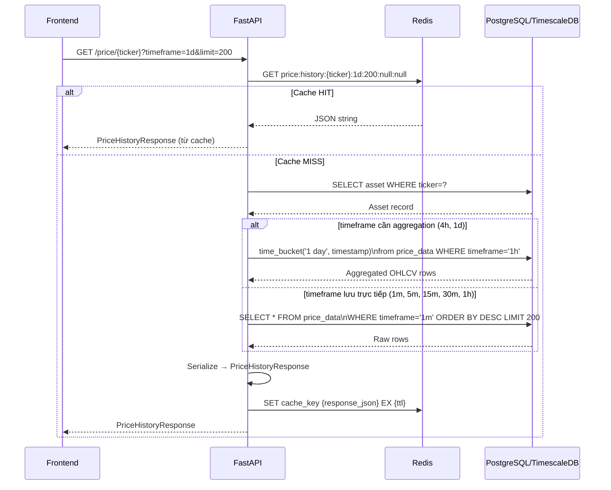
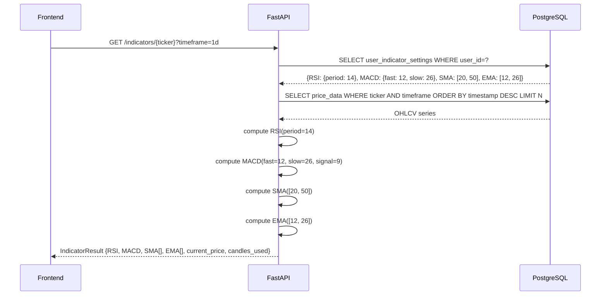
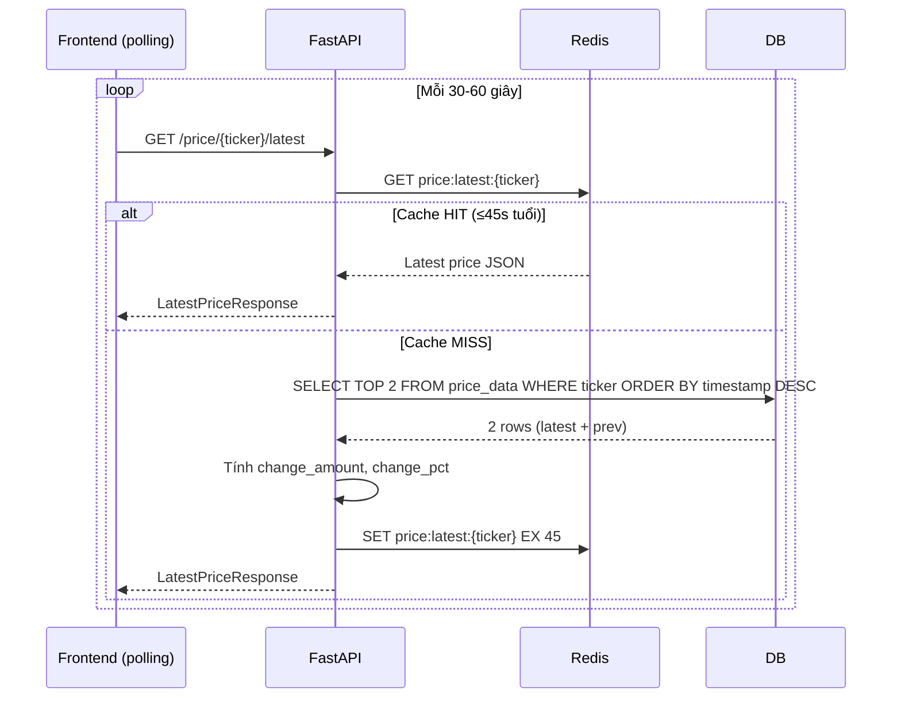

# 3.7.3 Luồng Xem Biểu Đồ và Chỉ Báo Kỹ Thuật

Luồng xem biểu đồ kỹ thuật phục vụ trang Chart của MarketMind — nơi người dùng xem candlestick chart và các chỉ báo kỹ thuật overlay (RSI, MACD, SMA, EMA). Luồng này được tối ưu cho tốc độ phản hồi thông qua Redis cache và chiến lược aggregation on-the-fly với TimescaleDB.

## Luồng tải dữ liệu biểu đồ

## Chiến lược lưu trữ và aggregation

Hệ thống không lưu riêng dữ liệu cho mọi timeframe. Thay vào đó, **4h và 1d được derive on-the-fly** từ dữ liệu 1h đã lưu:

| Timeframe yêu cầu | Nguồn dữ liệu | Phương pháp |
|-------------------|---------------|-------------|
| `1m` | Stored `1m` | Query trực tiếp |
| `5m` | Stored `5m` | Query trực tiếp |
| `15m` | Stored `15m` | Query trực tiếp |
| `30m` | Stored `30m` | Query trực tiếp |
| `1h` | Stored `1h` | Query trực tiếp |
| `4h` | Stored `1h` | `time_bucket('4 hours', timestamp)` |
| `1d` | Stored `1h` | `time_bucket('1 day', timestamp)` |

TimescaleDB `time_bucket()` cùng với `first()`, `last()`, `max()`, `min()`, `sum()` aggregate functions cho phép tính OHLCV aggregation chính xác trong một SQL query mà không cần lưu thêm bảng.

## Luồng tải chỉ báo kỹ thuật

**Cá nhân hóa chỉ báo:** Mỗi user có thể tùy chỉnh tham số indicator (RSI period, MACD fast/slow/signal, SMA/EMA periods) lưu trong bảng `user_indicator_settings` (JSONB). Khi tính chỉ báo, service đọc cài đặt cá nhân của user. Nếu user chưa có cài đặt, dùng giá trị mặc định chuẩn kỹ thuật (RSI 14, MACD 12/26/9).

## Luồng cập nhật giá real-time trên biểu đồ

**Không dùng WebSocket:** Giá được cập nhật qua polling từ frontend thay vì WebSocket push. Với tần suất cập nhật 1 phút (giới hạn bởi yfinance interval), polling 30-60 giây từ client là đủ để hiển thị "gần real-time" mà không cần duy trì connection liên tục — đơn giản hóa đáng kể phía server.

**Nến hiện tại:** `GET /price/{ticker}/latest` trả về nến 1m gần nhất cùng với `change_amount` và `change_pct` so với nến trước đó. Frontend dùng thông tin này để cập nhật nến đang hình thành trên chart mà không cần tải lại toàn bộ lịch sử.
